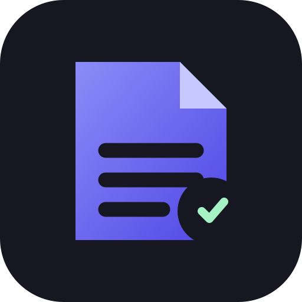

<p align="center">
  
</p>

<h1 align="center">Construct</h1>

<p align="center">
  A local-first desktop knowledge workspace for coding agents.
</p>

Construct watches the project folders where you work with coding agents and gives their Markdown output a dedicated place to live. Browse recent changes, read rendered documents, edit source, compare Git changes, arrange files in panes, and explore connected [Open Knowledge Format](https://github.com/GoogleCloudPlatform/knowledge-catalog/blob/main/okf/SPEC.md) bundles.

> **Status:** early preview for macOS. Construct is useful today, but distribution, signing, and large-workspace hardening are still in progress.

## Why Construct

Terminal-first agent workflows are excellent for conversation and execution, but poor at exposing the plans, specifications, reports, and knowledge files agents leave behind. Construct stays beside the terminal and turns those files into a navigable workspace without uploading their contents.

## Features

- Multiple local project folders with recursive Markdown discovery.
- Automatic filesystem monitoring and a deduplicated 30-day history.
- Tabs, horizontal and vertical panes, and workspace restoration.
- Rich Markdown editing plus editable source, with explicit saves and conflict protection.
- Document review with anchored quotes, persistent agent comments, and copyable handoffs.
- GFM preview with syntax highlighting, local images, and Mermaid.
- Read-only Git status and diff against `HEAD`.
- Dark and light themes, quick open, and Finder integration.
- Local full-text knowledge search across isolated per-folder indexes.
- Direct related-document navigation and budgeted context packs for agents.
- OKF bundle detection, metadata inspection, types, tags, links, and backlinks.
- OKF List and Graph views with multi-type filtering and stable type colors.

## Privacy

Construct processes project files locally. It does not require an account, send document content to remote services, or write to Git. External links open only after an explicit user action.

See [SECURITY.md](SECURITY.md) for reporting and security boundaries.

## Run from source

Requirements:

- macOS 13 or newer;
- Node.js 22;
- the Rust toolchain declared in `rust-toolchain.toml`;
- Xcode Command Line Tools.

```bash
git clone https://github.com/lfnovo/construct.git
cd construct
npm ci
npm run dev
```

## Validation

```bash
npm run validate
npm run build
```

The macOS bundle is written to:

```text
src-tauri/target/release/bundle/macos/Construct.app
```

## Project documentation

- [Documentation index](docs/README.md)
- [Product specification](docs/product-spec.md)
- [Architecture](docs/architecture.md)
- [Contributing](CONTRIBUTING.md)
- [Release process](docs/releasing.md)
- [Security policy](SECURITY.md)

## Roadmap

The current priority is a reliable macOS preview release and a read-only local
agent interface over the same retrieval core. Later candidates include Windows
and Linux, YAML and JSON, configurable exclusions, file management, optional
local semantic search, and signed automatic updates.

## License

Construct is available under the [MIT License](LICENSE).
