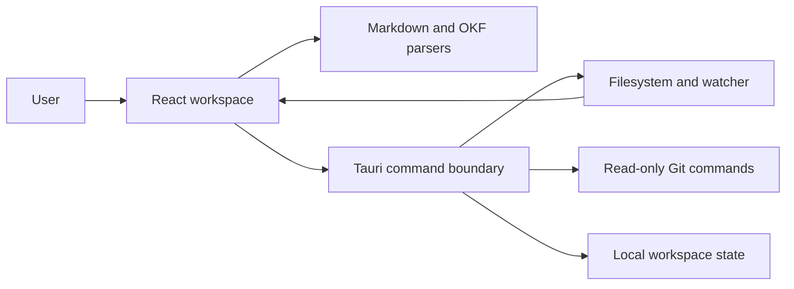

# Architecture

Construct is a local-first desktop application built with Tauri, React, TypeScript, and Rust. The architecture keeps presentation and document interpretation in the webview while native filesystem authority remains in the Rust process.

## System shape

No remote service is required for the core application.

## Frontend

The frontend lives in `src/`.

| Module | Responsibility |
| --- | --- |
| `App.tsx` | Workspace state, locations, panes, tabs, commands, and native event coordination |
| `CodeEditor.tsx` | CodeMirror lifecycle and Markdown editing |
| `VisualEditor.tsx` | Lazy-loaded Milkdown/Crepe lifecycle and rich Markdown editing |
| `ReviewEditor.tsx` | Rendered text selection, review composer, comment list, and clipboard handoff |
| `MarkdownPreview.tsx` | Sanitized Markdown rendering, Mermaid, images, and link routing |
| `markdownDocument.ts` | Lossless frontmatter/body boundaries and visual-editor serialization |
| `review.ts` | Pure parsing, lossless review-block updates, and agent prompt serialization |
| `okf.ts` | Pure OKF frontmatter inspection, link resolution, and graph inputs |
| `KnowledgeGraph.tsx` | Deterministic local graph layout and interactions |
| `history.ts` | File identity across repeated changes and renames |
| `explore.ts` | OKF filters and stable visual type assignment |
| `api.ts` | Typed Tauri command facade |
| `types.ts` | Persisted and runtime domain types |

Pure domain logic should stay outside `App.tsx` so it can be tested without a webview.

## Native core

`src-tauri/src/lib.rs` owns privileged operations:

- recursive Markdown discovery;
- default directory exclusions;
- filesystem watching;
- safe reads and explicit writes;
- workspace persistence;
- read-only Git inspection;
- Finder and external-link integration.

The frontend can operate only on files under registered locations. Path validation happens again in Rust; frontend checks are not a security boundary.

## Persistence

Workspace state is stored as `workspace.json` in the platform application data directory. It contains locations, UI layout, tabs, history metadata, and file fingerprints, but never document contents.

Changing the Tauri identifier or persisted schema requires a migration. Construct currently imports the former `com.luisnovo.agent-context` workspace on first launch.

## File change flow

1. Rust watches registered locations.
2. A filesystem event is emitted to the webview.
3. React debounces the event and rescans the affected workspace.
4. Fingerprints produce created, changed, renamed, or removed history entries.
5. Clean open tabs reload automatically.
6. Dirty tabs enter an explicit conflict state.

The persisted history retains the most recent event for each file identity and does not store snapshots.

## Markdown and OKF

Markdown preview uses a sanitized rendering pipeline. Mermaid runs only on fenced diagram blocks. Relative files are resolved locally and external URLs are handed to the operating system.

Preview, Edit, Review, and Source operate on one in-memory tab buffer. Source owns the raw
representation through CodeMirror. Edit is lazy-loaded and gives Milkdown only the
Markdown body; `markdownDocument.ts` retains the exact YAML frontmatter prefix and
reattaches it whenever the visual editor changes the body. Milkdown's normalized
baseline is mapped back to the original source bytes so opening Edit—or undoing all
visual changes—does not create a false dirty state. Saving remains an explicit Tauri
write through the existing tab flow.

The visual editor intentionally excludes remote AI features, image upload, and math
for its first release. Mermaid remains a fenced code block while editing and renders
in Preview. Malformed or unclosed frontmatter fails safely back to Source.

Review comments use a versioned `construct-review:v1` HTML comment at the boundary
between frontmatter and body. The block is invisible in rendered Markdown, remains
readable to local agents, and can be removed without changing the original document
bytes. `review.ts` owns parsing and serialization so Review, Edit, OKF indexing, and
clipboard handoff share one interpretation. Visual Edit removes the review block
from Milkdown's input and reattaches it unchanged; OKF link extraction excludes it.
Malformed review data fails closed to Source rather than being rewritten.

OKF support is derived and non-destructive:

- the bundle remains the source of truth;
- unknown metadata is preserved during inspection;
- indexes and graphs are rebuilt from local Markdown;
- Construct never completes or rewrites OKF metadata automatically.

## Security boundaries

- No document telemetry or remote content processing.
- No arbitrary shell command surface exposed to Markdown.
- Git commands are read-only and scoped to the file repository.
- HTML is sanitized before preview.
- Symlink traversal is disabled during discovery.
- Native writes require a registered location and explicit save.

## Known pressure points

`App.tsx` still coordinates several domains and should shrink through small extractions, not a broad rewrite. Large trees and history lists are not virtualized yet. Signing, notarization, updater design, and filesystem permission recovery remain release-readiness work.
