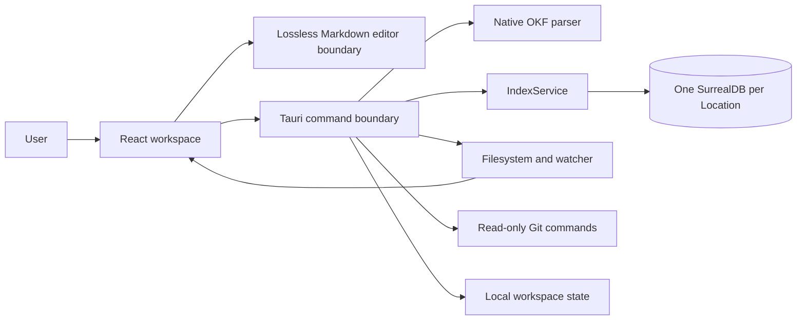

# Architecture

Construct is a local-first desktop application built with Tauri, React, TypeScript, and Rust. Presentation and lossless editing remain in the webview. Filesystem authority and retrieval-critical OKF interpretation live in the Rust process so future UI, index, CLI, and MCP consumers share one contract.

## System shape

No remote service is required for the core application.

## Frontend

The frontend lives in `src/`.

| Module | Responsibility |
| --- | --- |
| `App.tsx` | Workspace state, locations, panes, tabs, commands, and native event coordination |
| `CodeEditor.tsx` | CodeMirror lifecycle and Markdown editing |
| `VisualEditor.tsx` | Lazy-loaded Milkdown/Crepe lifecycle and rich Markdown editing |
| `ReviewEditor.tsx` | Rendered text selection, review composer, comment list, and clipboard handoff |
| `SearchWorkspace.tsx` | Dedicated local knowledge search, visible scope and filters, result selection, recent-query controls, and pane navigation |
| `MarkdownPreview.tsx` | Sanitized Markdown rendering, Mermaid, images, and link routing |
| `markdownDocument.ts` | Lossless frontmatter/body boundaries and visual-editor serialization |
| `review.ts` | Pure parsing, lossless review-block updates, and agent prompt serialization |
| `okf.ts` | Typed native OKF response contracts plus preview-only link resolution |
| `KnowledgeGraph.tsx` | Deterministic local graph layout and interactions |
| `history.ts` | File identity across repeated changes and renames |
| `explore.ts` | OKF filters and stable visual type assignment |
| `search.ts` | Pure search-filter, recent-query, identity, and relative-reference serialization helpers |
| `api.ts` | Typed Tauri command facade |
| `types.ts` | Persisted and runtime domain types |

Pure domain logic should stay outside `App.tsx` so it can be tested without a webview.

## Native core

`src-tauri/src/lib.rs` owns privileged operations:

- recursive Markdown discovery;
- default directory exclusions;
- filesystem watching;
- safe reads and explicit writes;
- workspace persistence;
- read-only Git inspection;
- Finder and external-link integration.

`src-tauri/src/okf.rs` owns the shared, read-only OKF interpretation:

- tolerant YAML frontmatter parsing for v0.1, v0.2, and future metadata;
- an open-ended typed metadata tree plus normalized convenience fields;
- technical document roles and stable findings;
- CommonMark inline and reference link extraction;
- safe bundle-relative path resolution and broken-link diagnostics;
- the derived in-memory snapshot consumed by detection, Explore, and Graph.

The parser is isolated from filesystem mutation. It receives saved files for
bundle snapshots or an in-memory tab buffer for the inspector and never
serializes YAML back into a document. YAML and CommonMark dependencies stay
behind this module so they can be replaced without changing the Tauri contract.

`src-tauri/src/index.rs` owns the first persistent retrieval boundary:

- one embedded SurrealDB/SurrealKV directory per stable Location ID;
- one serialized writer and connection owner per Location;
- a disposable schema and active-generation record;
- incremental fingerprint comparison and transactional document updates;
- complete visible Markdown bodies, typed frontmatter, headings, and a clean
  full-text search projection;
- weighted field-specific full-text indexes and exact metadata filters;
- local rank explanations and cross-Location reciprocal rank fusion;
- typed status, rebuild, facets, knowledge search, get, and delete operations.

`IndexService` is transport-neutral and is the only component allowed to open
the embedded databases. React calls it through typed Tauri commands. Future CLI
and MCP adapters must reuse the service instead of opening SurrealKV directly.

The frontend can operate only on files under registered locations. Path validation happens again in Rust; frontend checks are not a security boundary.

## Persistence

Workspace state is stored as `workspace.json` in the platform application data directory. It contains locations, UI layout, tabs, history metadata, and file fingerprints, but never document contents.

The workspace may also retain up to 20 explicitly submitted recent knowledge
queries with Location IDs and filters. This retention is local, user-clearable,
and optional. It never stores result snippets or document contents.

Saved Markdown is also represented in disposable per-Location indexes under
the application data `indexes/` directory. Those indexes contain document
bodies and metadata for local retrieval, are never placed inside a repository,
and can be deleted or rebuilt without changing source files. Workspace state
and retrieval indexes have separate schemas and lifecycles.

Changing the Tauri identifier or persisted schema requires a migration. Construct currently imports the former `com.luisnovo.agent-context` workspace on first launch.

## File change flow

1. Rust watches registered locations.
2. A filesystem event is emitted to the webview.
3. React debounces the event and rescans the affected workspace.
4. Fingerprints produce created, changed, renamed, or removed history entries.
5. `IndexService` reconciles the saved corpus and updates only changed or
   removed records in the active Location generation.
6. Clean open tabs reload automatically.
7. Dirty tabs enter an explicit conflict state.

The persisted history retains the most recent event for each file identity and does not store snapshots.

## Markdown and OKF

Markdown preview uses a sanitized rendering pipeline. Mermaid runs only on fenced diagram blocks. Relative files are resolved locally and external URLs are handed to the operating system.

Preview, Edit, Review, and Source operate on one in-memory tab buffer. Source owns the raw
representation through CodeMirror. Edit is lazy-loaded and gives Milkdown only the
Markdown body; `markdownDocument.ts` retains the exact YAML frontmatter prefix and
reattaches it whenever the visual editor changes the body. Milkdown's normalized
baseline is mapped back to the original source bytes so opening Edit—or undoing all
visual changes—does not create a false dirty state. Saving remains an explicit Tauri
write through the existing tab flow.

The visual editor intentionally excludes remote AI features, image upload, and math
for its first release. Mermaid remains a fenced code block while editing and renders
in Preview. Malformed or unclosed frontmatter fails safely back to Source.

Review comments use a versioned `construct-review:v1` HTML comment at the boundary
between frontmatter and body. The block is invisible in rendered Markdown, remains
readable to local agents, and can be removed without changing the original document
bytes. `review.ts` owns parsing and serialization so Review, Edit, OKF indexing, and
clipboard handoff share one interpretation. Visual Edit removes the review block
from Milkdown's input and reattaches it unchanged; OKF link extraction excludes it.
Malformed review data fails closed to Source rather than being rewritten.

OKF support is derived and non-destructive:

- the bundle remains the source of truth;
- unknown and nested YAML metadata is preserved as typed values during inspection;
- `generated.at` is normalized as the preferred v0.2 timestamp while legacy
  `timestamp` remains available;
- stable findings describe malformed YAML, missing required fields,
  compatibility behavior, broken links, and unsafe paths;
- bundle detection, the inspector, Explore, and Graph consume the same native
  interpretation;
- Explore and Graph still consume the in-memory bundle snapshot while the new
  persistent index is introduced behind typed native commands;
- all registered Markdown is now maintained in a per-Location persistent
  derived index, with OKF enrichment when applicable;
- Construct never completes or rewrites OKF metadata automatically.

## Security boundaries

- No document telemetry or remote content processing.
- No arbitrary shell command surface exposed to Markdown.
- Git commands are read-only and scoped to the file repository.
- HTML is sanitized before preview.
- Symlink traversal is disabled during discovery.
- OKF inspection bounds document size, frontmatter size, and YAML nesting.
- OKF links that normalize outside the registered bundle are rejected from the graph.
- Native writes require a registered location and explicit save.

## Known pressure points

`App.tsx` still coordinates several domains and should shrink through small extractions, not a broad rewrite. Large trees and history lists are not virtualized yet. Signing, notarization, updater design, and filesystem permission recovery remain release-readiness work.
