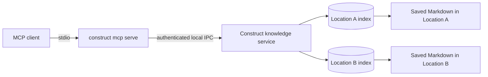

# Local MCP access

**Status:** Current preview behavior on macOS and Unix

Construct can expose registered Locations to coding agents through a local
Model Context Protocol stdio server. The server uses the same per-Location
indexes as the desktop and gives agents read-only knowledge tools without
granting arbitrary filesystem, Git, shell, SQL, or mutation access.

The MCP server is not currently available on Windows because the knowledge
service uses authenticated Unix-domain socket IPC.

## How it works



Each Location has its own physical embedded database. The MCP process receives
an explicit allowlist of registered Location IDs, reconciles their saved files,
and can query only those indexes.

No network listener is opened. Construct itself makes no outbound request.
The MCP client controls where retrieved content goes after it leaves Construct.

## Recommended setup

1. Open Construct.
2. Register the folders you want to use as Locations.
3. Wait for the relevant Location index to become ready.
4. Select one Location.
5. Use the clipboard button in the **Locations** header.
6. Paste the copied configuration into your MCP client.
7. Restart or reload the client if it does not discover the new server.

The copied JSON resembles:

```json
{
  "mcpServers": {
    "construct": {
      "command": "/Applications/Construct.app/Contents/MacOS/construct",
      "args": [
        "mcp",
        "serve",
        "--data-dir",
        "/Users/you/Library/Application Support/com.luisnovo.construct",
        "--allow",
        "registered-location-id"
      ]
    }
  }
}
```

Construct copies the actual executable path, application-data path, and selected
Location ID from the running app. Prefer this over constructing IDs manually.

If the app is moved or replaced, copy the configuration again so the command
continues to point to an existing executable.

## Configure a custom stdio form

Clients that use separate form fields should receive:

| Field | Value |
| --- | --- |
| Name | `Construct` |
| Type | `STDIO` |
| Command | Absolute path to the `construct` executable |
| Working directory | Optional |

Add each argument as a separate value, in this order:

```text
mcp
serve
--data-dir
/Users/you/Library/Application Support/com.luisnovo.construct
--allow
registered-location-id
```

Do not put the complete command line into the command field. Paths containing
spaces are safe when the client passes command and arguments separately.

## Allow one, several, or all Locations

The safest configuration grants one Location:

```bash
construct mcp serve \
  --data-dir "/Users/you/Library/Application Support/com.luisnovo.construct" \
  --allow registered-location-id
```

Repeat `--allow` to grant several registered Locations:

```bash
construct mcp serve \
  --data-dir "/Users/you/Library/Application Support/com.luisnovo.construct" \
  --allow first-location-id \
  --allow second-location-id
```

Grant every Location in that Construct profile only when the MCP client should
be trusted with all of them:

```bash
construct mcp serve \
  --data-dir "/Users/you/Library/Application Support/com.luisnovo.construct" \
  --allow-all
```

`--allow-all` is broader than the generated configuration and automatically
includes Locations registered later. It is useful for a personal agent that
needs a complete local memory, but it weakens isolation. It does not mean
arbitrary filesystem access: only registered Locations are exposed.

The server refuses to start without at least one `--allow` or `--allow-all`,
and rejects unknown or unregistered Location IDs.

## Tools available to agents

### `construct_list_locations`

Lists the allowed Locations, their IDs, OKF status, current index status, and
available capabilities. It never lists registered Locations outside the
server's allowlist.

### `construct_get_location_overview`

The best first call for “hot memory.” It summarizes:

- counts by OKF type, tag, and technical role;
- link health and findings;
- recent entries from reserved OKF `log.md` files, including nested scopes;
- documents with recent changes, successful MCP reads, or context-pack use.

The overview helps an agent orient itself before a broad search.

### `construct_get_location_activity`

Returns bounded activity for the last 1–15 days, optionally under a relative
path prefix. Change, served-document, and context-pack counters remain
separate. Search result impressions and index rebuilds do not fabricate
activity.

### `construct_search_knowledge`

Searches saved Markdown across one or more allowed Locations using weighted
full-text ranking. It supports filters for:

- type;
- tag;
- technical role;
- status;
- trust;
- freshness;
- path prefix;
- presence of findings.

Search returns compact candidates, not arbitrary filesystem reads. Normal
responses use Location ID and relative path.

### `construct_read_document`

Reads one saved indexed Markdown document by allowed Location ID and relative
path. A successful read contributes to the local hot-memory activity cache.

### `construct_get_related_documents`

Returns bounded direct outgoing links and backlinks for one indexed document.
It does not perform unbounded traversal or cross Location boundaries
automatically.

### `construct_build_context_pack`

Assembles explicit selected documents into a bounded, provenance-rich text
package. The caller can supply:

- an optional query;
- Location ID, relative path, and reason for each document;
- a character budget from 1,000 to 200,000;
- a document limit up to 20.

Construct preserves visible document boundaries, reports truncation or
omission, and distributes the budget so one large document cannot starve all
others. Included documents contribute to hot-memory activity.

This tool assembles evidence; it does not call an LLM, answer the question, or
save content.

### `construct_get_index_status`

Reports generation, freshness, document counts, storage size, build progress,
and errors for one allowed Location.

## Recommended agent workflow

For a new session:

1. call `construct_list_locations`;
2. call `construct_get_location_overview` for the relevant Location;
3. use recent logs and activity to understand current work;
4. search for the concrete question;
5. read only the strongest candidates;
6. follow direct relationships when useful;
7. build a context pack when a downstream task needs a bounded handoff.

This keeps discovery compact and makes the source of every retrieved document
visible.

## Read-only and privacy boundaries

The initial MCP surface cannot:

- create, edit, save, move, rename, or delete files;
- stage, commit, or otherwise write through Git;
- execute shell commands;
- execute arbitrary SQL or expose the embedded database;
- read arbitrary absolute paths;
- access Locations outside the startup allowlist;
- send content to a remote service.

MCP responses can contain the full saved content of documents the client asks
to read. A cloud-backed MCP client or model provider may transmit that content
according to its own configuration. Construct cannot enforce the client's
downstream privacy policy.

Review comments are not silently mixed into normal indexed document content.

## Activity cache

The per-Location index keeps a disposable daily activity cache for 15 days:

- real saved-file changes;
- successful document reads through MCP;
- documents included in MCP context packs.

These counters are local, use relative document identities, and exist only to
help later agents orient themselves. Rebuilding or deleting the derived index
can reset them without affecting Markdown.

## Troubleshooting

### The server exits immediately

Check stderr for one of these common causes:

- no `--allow` or `--allow-all`;
- the allowed Location ID is not registered in the selected `--data-dir`;
- the data directory belongs to another Construct profile;
- the executable path no longer exists;
- the platform does not support the local knowledge transport.

### The client shows no tools

Confirm that the server type is stdio, command and arguments are separate, and
the client has reloaded its MCP configuration. The server writes protocol
messages only to stdout; launch errors go to stderr.

### A document is missing or stale

Check `construct_get_index_status`. The MCP process reconciles allowed
Locations when it starts and periodically while the session is active. If the
index is degraded, use the desktop's **Rebuild index** action or restart the
server after resolving filesystem access.

### The server is connected to the wrong Locations

Copy a fresh configuration from the intended Construct profile and Location.
Avoid `--allow-all` when profiles contain unrelated or sensitive folders.

## Test the server during development

After building the debug executable:

```bash
npm run test:mcp
```

The smoke script uses the local binary and verifies the MCP path without
granting source mutation.
