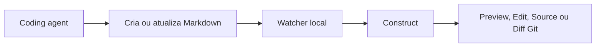

# Construct — Especificação de Produto

> Documento vivo que define o comportamento esperado do produto. Decisões de implementação devem preservar estes requisitos ou atualizar explicitamente esta especificação.

| Campo | Valor |
| --- | --- |
| Status | Preview funcional em fase de hardening |
| Versão | 0.2 |
| Data | 25 de julho de 2026 |
| Plataforma inicial | macOS |
| Plataformas futuras | Windows e Linux |
| Nome do produto | **Construct** |

## 1. Resumo

Construct é um aplicativo desktop para localizar, acompanhar, visualizar e editar arquivos de contexto produzidos por coding agents em diferentes projetos.

O produto atende principalmente pessoas que trabalham com agentes pelo terminal e não têm acesso conveniente aos arquivos do projeto durante a sessão. O aplicativo permite cadastrar pastas monitoradas, navegar recursivamente pelos arquivos Markdown, abrir múltiplos documentos em abas e painéis, visualizar Markdown renderizado, editar o conteúdo e acompanhar mudanças feitas externamente pelos agentes.

O aplicativo é um companion para o fluxo de trabalho com agentes. Ele não pretende substituir uma IDE, um terminal, um cliente Git ou um gerenciador de arquivos completo.

## 2. Problema

Coding agents frequentemente produzem planos, relatórios, memórias, especificações e outros artefatos em Markdown. Quando a interação com esses agentes acontece em terminais — especialmente dentro de multiplexadores como o Herdr — esses arquivos ficam pouco visíveis.

O usuário precisa interromper o fluxo, abrir outra ferramenta, encontrar o projeto e navegar até o arquivo. Quando existem vários agentes e vários projetos ativos, também é difícil saber o que foi criado ou alterado recentemente.

Os principais problemas são:

- falta de uma visão unificada das pastas usadas com agentes;
- dificuldade para descobrir arquivos criados ou alterados durante as sessões;
- atrito para ler Markdown renderizado;
- necessidade de abrir uma IDE apenas para fazer pequenas edições;
- dificuldade para comparar arquivos ou consultar dois documentos simultaneamente;
- falta de um histórico simples das mudanças observadas em vários projetos.

## 3. Visão do produto

Ser o lugar mais rápido e agradável para acompanhar os arquivos de contexto gerados por agentes, independentemente do terminal, agente ou projeto usado.

O produto deve transmitir a sensação de uma mesa de leitura dedicada: projetos à esquerda, documentos organizados e a área de trabalho livre para ler, editar e comparar conteúdos.

## 4. Objetivos

### 4.1 Objetivos do MVP

- Permitir que o usuário cadastre uma ou mais pastas locais.
- Descobrir recursivamente arquivos Markdown dentro dessas pastas.
- Mostrar arquivos ocultos relevantes ao trabalho com agentes.
- Atualizar a interface conforme arquivos forem criados, alterados, renomeados ou removidos externamente.
- Oferecer leitura em Preview e edição em Edit ou Source.
- Permitir edição e salvamento explícito dos arquivos.
- Permitir vários documentos em abas e vários painéis lado a lado.
- Manter um histórico persistente das mudanças observadas.
- Mostrar diff somente para arquivos dentro de repositórios Git.
- Restaurar o workspace entre execuções.
- Manter uma arquitetura que não impeça suporte futuro a Windows e Linux.

### 4.2 Indicadores de sucesso iniciais

Os indicadores abaixo orientam validação qualitativa e telemetria futura; não exigem coleta de dados no MVP.

- O usuário consegue adicionar um projeto e abrir um arquivo Markdown em menos de um minuto.
- Um arquivo criado por um agente aparece no aplicativo sem ação manual de atualização.
- O usuário consegue encontrar um arquivo recente sem saber seu caminho exato.
- O usuário consegue consultar dois documentos lado a lado sem abrir outra ferramenta.
- O aplicativo pode ser reaberto e retomar o workspace anterior.
- Nenhuma edição local é perdida silenciosamente por causa de uma mudança externa.

## 5. Não objetivos do MVP

- Substituir uma IDE ou editor de código completo.
- Executar coding agents ou hospedar terminais.
- Fazer commits, staging, checkout, merge ou outras operações de escrita no Git.
- Sincronizar arquivos entre dispositivos.
- Colaborar em tempo real com outras pessoas.
- Guardar versões históricas completas dos arquivos.
- Visualizar ou editar formatos além de Markdown.
- Fazer busca textual no conteúdo dos arquivos.
- Oferecer configuração personalizada de diretórios ignorados.
- Gerenciar arquivos de maneira completa, incluindo criar pastas, copiar, mover e excluir.
- Instalar plugins ou executar extensões de terceiros.

## 6. Princípios de produto

1. **Local first:** o conteúdo permanece no computador do usuário e não depende de uma conta ou serviço remoto.
2. **Arquivos são a fonte da verdade:** o aplicativo lê e escreve os arquivos reais; não cria um formato proprietário para o conteúdo.
3. **Mudanças externas são esperadas:** coding agents e outras ferramentas podem modificar um arquivo a qualquer momento.
4. **Nunca perder trabalho silenciosamente:** conflitos e falhas de salvamento devem ser explícitos.
5. **Leitura em primeiro lugar:** Markdown renderizado deve ser agradável, rápido e fiel.
6. **Complexidade progressiva:** a interface inicial deve ser simples, enquanto abas, painéis, Git e histórico aparecem quando necessários.
7. **Portabilidade deliberada:** comportamentos centrais não devem depender de APIs exclusivas do macOS quando houver uma abstração multiplataforma razoável.

## 7. Terminologia

| Termo | Definição |
| --- | --- |
| Local | Pasta raiz cadastrada e monitorada pelo usuário. Pode representar um projeto inteiro ou uma pasta específica de contexto. |
| Arquivo | Documento Markdown descoberto dentro de um Local. |
| Aba | Representação de um arquivo aberto dentro de um Painel. |
| Painel | Área de leitura ou edição que contém uma ou mais abas. Também chamado de pane. |
| Workspace | Conjunto de Locais, abas, painéis, seleções e preferências restauráveis. |
| Preview | Markdown renderizado. |
| Edit | Edição visual do corpo Markdown, com comandos e formatação contextual. |
| Source | Conteúdo Markdown bruto e editável. |
| Mudança externa | Alteração no sistema de arquivos feita fora do aplicativo. |
| Histórico | Linha do tempo local de eventos observados pelo aplicativo. |
| Diff Git | Comparação somente leitura entre o arquivo atual e a referência Git definida nesta especificação. |

## 8. Público e cenários principais

### 8.1 Público inicial

Desenvolvedores que:

- usam coding agents por terminal;
- trabalham com múltiplas sessões ou projetos;
- recebem artefatos Markdown produzidos por agentes;
- querem acompanhar esses artefatos sem abrir uma IDE completa.

### 8.2 Cenários principais

#### Acompanhar um agente

1. O usuário cadastra a pasta do projeto.
2. O agente cria `implementation-plan.md`.
3. O arquivo aparece na árvore e no Histórico.
4. O usuário abre o arquivo em Preview.
5. Quando o agente atualiza o plano, o Preview é atualizado automaticamente.

#### Editar uma especificação

1. O usuário abre um arquivo em Edit ou Source.
2. Faz alterações; a aba passa a indicar estado não salvo.
3. Pressiona `⌘S`.
4. O arquivo é salvo no disco e o indicador desaparece.
5. A mudança passa a constar no Histórico e, se aplicável, no Diff Git.

#### Comparar contexto

1. O usuário abre dois arquivos em abas.
2. Divide a área de trabalho vertical ou horizontalmente.
3. Move ou abre um dos arquivos no segundo painel.
4. Mantém um documento em Edit ou Source e outro em Preview.

#### Revisar mudanças recentes

1. O usuário abre o aplicativo depois de trabalhar em vários projetos.
2. O Histórico mostra arquivos modificados e eventos detectados desde a última sessão.
3. O usuário seleciona um evento para abrir o arquivo e seu Local.
4. Se o arquivo estiver em Git, pode abrir o Diff Git.

## 9. Arquitetura da informação

A janela principal possui duas regiões:

```text
┌──────────────────────┬─────────────────────────────────────────────┐
│ LOCAIS               │ Painel 1                     │ Painel 2     │
│  Projeto A           │ plano.md | notas.md          │ AGENTS.md    │
│  Projeto B           ├──────────────────────────────┼──────────────┤
├──────────────────────┤                              │              │
│ ARQUIVOS             │ Preview, Edit ou Source      │ Preview      │
│  docs/               │                              │              │
│    plano.md          │                              │              │
│  AGENTS.md           │                              │              │
├──────────────────────┤                              │              │
│ HISTÓRICO            │                              │              │
│  plano.md        2m  │                              │              │
│  AGENTS.md      15m  │                              │              │
└──────────────────────┴──────────────────────────────┴──────────────┘
```

### 9.1 Sidebar

A sidebar é redimensionável e contém três seções também redimensionáveis:

1. **Locais:** lista das pastas cadastradas.
2. **Arquivos:** árvore recursiva do Local selecionado.
3. **Histórico:** eventos recentes agregados de todos os Locais.

Cada seção pode ser recolhida. O aplicativo deve preservar seus tamanhos e estados de expansão.

### 9.2 Área principal

A área principal contém um ou mais Painéis. Cada Painel possui:

- barra de abas;
- indicação de arquivo ativo;
- indicação de edição não salva;
- seletor ou ação para alternar entre Preview, Edit e Source;
- conteúdo do arquivo;
- estados de carregamento, erro, conflito e arquivo indisponível.

## 10. Requisitos funcionais

### 10.1 Locais

- **LOC-001:** O usuário pode adicionar um Local usando o seletor nativo de pastas.
- **LOC-002:** O aplicativo deve solicitar apenas as permissões necessárias para ler e editar o Local escolhido.
- **LOC-003:** O mesmo caminho não pode ser cadastrado duas vezes.
- **LOC-004:** Cada Local exibe por padrão o nome da pasta raiz.
- **LOC-005:** O usuário pode remover um Local do aplicativo sem apagar ou alterar a pasta no disco.
- **LOC-006:** O usuário pode revelar um Local no gerenciador de arquivos do sistema.
- **LOC-007:** O aplicativo deve preservar a ordem dos Locais.
- **LOC-008:** O usuário pode reordenar os Locais por arrastar e soltar.
- **LOC-009:** Quando um Local estiver indisponível, ele permanece cadastrado e recebe um estado visual de indisponibilidade.
- **LOC-010:** Quando um Local voltar a ficar disponível, o aplicativo deve retomar a varredura e o monitoramento automaticamente.
- **LOC-011:** Um Local pode ser uma raiz de projeto ou qualquer subdiretório escolhido pelo usuário.
- **LOC-012:** Se Locais cadastrados se sobrepuserem, o aplicativo deve evitar duplicar eventos internamente, mas pode exibir o arquivo no contexto de cada Local.

### 10.2 Descoberta e árvore de arquivos

- **FILE-001:** A descoberta deve ser recursiva a partir da raiz do Local.
- **FILE-002:** O MVP reconhece extensões `.md` e `.markdown`, sem diferenciar maiúsculas de minúsculas.
- **FILE-003:** Arquivos e diretórios ocultos devem aparecer normalmente, exceto quando estiverem na lista de exclusão padrão.
- **FILE-004:** A árvore deve representar a hierarquia relativa ao Local.
- **FILE-005:** Diretórios vazios, considerando os filtros ativos, não precisam aparecer.
- **FILE-006:** Diretórios podem ser expandidos e recolhidos.
- **FILE-007:** O estado de expansão deve ser preservado entre execuções quando for razoável.
- **FILE-008:** A árvore deve ter atualização incremental, evitando reconstruções visuais completas a cada evento.
- **FILE-009:** Arquivos com o mesmo nome devem ser distinguíveis pelo caminho relativo.
- **FILE-010:** O menu de contexto do arquivo deve oferecer ao menos Abrir, Abrir à direita, Revelar no Finder e Copiar caminho.
- **FILE-011:** Links simbólicos não devem ser percorridos recursivamente no MVP, evitando ciclos e fuga acidental do Local.
- **FILE-012:** Arquivos acessados por link simbólico podem ser marcados como não suportados até uma decisão futura.

### 10.3 Exclusões padrão

A varredura e o monitoramento devem ignorar diretórios de controle de versão, dependências, ambientes, caches e artefatos de build. A comparação do nome deve respeitar as regras de sensibilidade a maiúsculas do sistema de arquivos.

Lista inicial:

```text
.git
.hg
.svn
node_modules
vendor
.venv
venv
__pycache__
.pytest_cache
.mypy_cache
.ruff_cache
target
dist
build
out
.next
.nuxt
.svelte-kit
.gradle
.idea
Pods
DerivedData
bin
obj
.terraform
.dart_tool
.pub-cache
coverage
.coverage
```

- **IGNORE-001:** As exclusões são aplicadas em qualquer profundidade.
- **IGNORE-002:** O diretório `.git` pode ser consultado indiretamente por operações Git, mas nunca aparece na árvore.
- **IGNORE-003:** Não haverá interface para editar a lista no MVP.
- **IGNORE-004:** A arquitetura deve permitir exclusões globais e por Local em uma versão futura.
- **IGNORE-005:** O aplicativo não precisa respeitar `.gitignore` no MVP, pois arquivos de contexto ignorados pelo Git ainda podem ser relevantes.

### 10.4 Abertura e navegação

- **NAV-001:** Um clique em um arquivo o abre no Painel ativo.
- **NAV-002:** Se o arquivo já estiver aberto nesse Painel, sua aba deve receber foco.
- **NAV-003:** Se o arquivo estiver aberto em outro Painel, o comportamento padrão é focar a instância existente.
- **NAV-004:** Deve existir uma ação explícita para abrir outra visualização do mesmo arquivo em outro Painel.
- **NAV-005:** O aplicativo deve preservar a posição de rolagem separadamente para Preview, Edit e Source enquanto a aba estiver aberta.
- **NAV-006:** Ao selecionar um evento no Histórico, o Local correspondente é selecionado, o arquivo é revelado na árvore e sua aba recebe foco.
- **NAV-007:** O caminho relativo completo deve estar disponível na interface, mesmo que não permaneça visível o tempo todo.

### 10.5 Abas

- **TAB-001:** Cada Painel pode conter múltiplas abas.
- **TAB-002:** Abas podem ser reordenadas por arrastar e soltar.
- **TAB-003:** Abas podem ser movidas entre Painéis.
- **TAB-004:** Uma aba modificada deve exibir um indicador inequívoco de conteúdo não salvo.
- **TAB-005:** Fechar uma aba modificada abre uma confirmação com as opções Salvar, Não salvar e Cancelar.
- **TAB-006:** `⌘W` fecha a aba ativa; se for a última aba, o Painel pode permanecer vazio.
- **TAB-007:** O título da aba usa o nome do arquivo e oferece o caminho relativo em tooltip ou elemento equivalente.
- **TAB-008:** O aplicativo deve indicar quando duas abas possuem nomes iguais e pertencem a caminhos diferentes.
- **TAB-009:** O menu de contexto de uma aba deve oferecer ao menos Recarregar do disco, Copiar caminho e Revelar no Finder.

### 10.6 Painéis

- **PANE-001:** O usuário pode dividir um Painel verticalmente ou horizontalmente.
- **PANE-002:** A divisão cria um novo Painel ao lado do atual.
- **PANE-003:** Os Painéis são redimensionáveis.
- **PANE-004:** Cada Painel mantém suas próprias abas e aba ativa.
- **PANE-005:** Cada aba mantém seu próprio modo Preview, Edit, Source ou Diff.
- **PANE-006:** O usuário pode fechar um Painel; suas abas devem ser movidas ou fechadas de maneira segura.
- **PANE-007:** Não há limite funcional rígido de Painéis, embora a interface possa impedir divisões que resultem em áreas inutilizáveis.
- **PANE-008:** Arrastar uma aba para uma borda pode criar uma divisão como aprimoramento, mas ações explícitas devem existir desde o MVP.
- **PANE-009:** O layout dos Painéis deve ser restaurado entre execuções.

### 10.7 Edição visual e Source

- **EDIT-001:** Source exibe o conteúdo Markdown bruto em um editor de texto monoespaçado.
- **EDIT-002:** O editor deve oferecer numeração de linhas e destaque de sintaxe Markdown.
- **EDIT-003:** O MVP usa salvamento explícito; não há autosave.
- **EDIT-004:** `⌘S` salva o arquivo ativo.
- **EDIT-005:** O salvamento deve minimizar risco de corrupção e evitar deixar arquivos parcialmente escritos.
- **EDIT-006:** Depois do salvamento bem-sucedido, a aba deixa o estado não salvo.
- **EDIT-007:** Uma falha de salvamento preserva o buffer e mostra uma mensagem acionável.
- **EDIT-008:** O aplicativo deve preservar o tipo de quebra de linha existente quando possível.
- **EDIT-009:** UTF-8 é a codificação suportada pelo MVP. Arquivos inválidos devem abrir em estado de erro sem tentativa silenciosa de conversão.
- **EDIT-010:** Desfazer e refazer devem funcionar enquanto a aba permanecer aberta.
- **EDIT-011:** O aplicativo deve fornecer operações básicas de seleção, copiar, recortar, colar e localizar dentro do arquivo aberto.
- **EDIT-012:** A alternância para Preview não salva automaticamente o arquivo.
- **EDIT-013:** O Preview de uma aba modificada deve renderizar o buffer local, não a versão antiga do disco.
- **EDIT-014:** Edit oferece edição visual do corpo do documento com títulos, parágrafos, listas, checklists, citações, links, tabelas e blocos de código.
- **EDIT-015:** Preview, Edit e Source compartilham o mesmo buffer local e o mesmo estado de salvamento explícito.
- **EDIT-016:** Abrir Edit ou alternar entre modos sem fazer alterações não pode marcar a aba como modificada nem normalizar o arquivo no disco.
- **EDIT-017:** Ao desfazer todas as alterações visuais, o buffer deve voltar ao conteúdo fonte exato que existia antes da edição, incluindo quebras de linha e serialização Markdown.
- **EDIT-018:** Frontmatter YAML deve ser preservado byte a byte por Edit. A edição de metadados continua disponível em Source.
- **EDIT-019:** Frontmatter não fechado ou estruturalmente inválido impede Edit de iniciar e oferece uma ação para abrir Source, sem ocultar ou alterar o conteúdo.
- **EDIT-020:** Edit não deve oferecer upload ou colagem persistente de imagens enquanto não existir uma estratégia local que produza referências de arquivo estáveis.
- **EDIT-021:** Diagramas Mermaid permanecem editáveis como blocos de código em Edit e são renderizados em Preview.
- **EDIT-022:** A primeira edição visual real pode serializar o corpo segundo a forma canônica do editor; o frontmatter permanece intacto e o Diff Git torna essa alteração explícita.

### 10.8 Preview Markdown

- **PREVIEW-001:** O Preview deve suportar CommonMark e extensões amplamente usadas no GitHub Flavored Markdown.
- **PREVIEW-002:** Deve renderizar títulos, listas, citações, links, imagens, tabelas, separadores e blocos de código.
- **PREVIEW-003:** Checklists devem ser renderizadas; sua interação pode ser apenas visual no MVP.
- **PREVIEW-004:** Blocos de código devem ter syntax highlighting quando a linguagem for reconhecida.
- **PREVIEW-005:** Diagramas Mermaid devem ser renderizados.
- **PREVIEW-006:** Erros em um diagrama Mermaid devem ser isolados e não impedir a renderização do restante do documento.
- **PREVIEW-007:** HTML embutido deve ser sanitizado. Scripts e execução arbitrária de conteúdo não são permitidos.
- **PREVIEW-008:** Imagens relativas devem ser resolvidas a partir do diretório do arquivo Markdown.
- **PREVIEW-009:** Recursos remotos podem ser carregados apenas conforme a política de privacidade e segurança definida para a implementação.
- **PREVIEW-010:** O Preview deve oferecer tipografia legível e largura de texto confortável, sem modificar o arquivo.

### Exemplo de diagrama Mermaid

O Preview deve renderizar este fluxo, usado também como caso de validação visual:



### 10.9 Links

- **LINK-001:** Links relativos para arquivos Markdown existentes dentro de um Local devem abrir dentro do aplicativo.
- **LINK-002:** Links com fragmentos devem tentar navegar até o título ou âncora correspondente.
- **LINK-003:** Links externos `http` e `https` devem abrir no navegador padrão.
- **LINK-004:** Links para arquivos locais não suportados podem ser revelados no Finder ou abertos no aplicativo padrão, após uma ação explícita do usuário.
- **LINK-005:** Links quebrados devem produzir feedback discreto e acionável.
- **LINK-006:** O aplicativo não deve executar esquemas de URL desconhecidos sem confirmação.

### 10.10 Monitoramento do sistema de arquivos

- **WATCH-001:** Cada Local disponível deve ser monitorado para criação, alteração, renomeação e remoção.
- **WATCH-002:** Eventos em rajada devem ser agrupados para evitar duplicidade e instabilidade visual.
- **WATCH-003:** Um arquivo novo suportado aparece na árvore e no Histórico sem atualização manual.
- **WATCH-004:** Um arquivo removido desaparece da árvore e gera evento no Histórico.
- **WATCH-005:** Um arquivo renomeado deve ser tratado preferencialmente como renomeação; quando o sistema não oferecer evidência suficiente, pode ser registrado como remoção e criação.
- **WATCH-006:** Se um arquivo aberto e sem mudanças locais for alterado externamente, seu conteúdo e Preview são atualizados automaticamente.
- **WATCH-007:** A atualização automática deve preservar a posição de leitura tanto quanto possível.
- **WATCH-008:** Se um arquivo aberto tiver mudanças locais não salvas, uma alteração externa não pode substituir o buffer.
- **WATCH-009:** No conflito acima, a aba exibe um aviso persistente com as ações Recarregar versão externa e Manter minhas alterações.
- **WATCH-010:** Recarregar descarta o buffer somente após confirmação explícita.
- **WATCH-011:** Manter minhas alterações conserva o buffer; um salvamento posterior deve exigir confirmação de que substituirá a versão externa.
- **WATCH-012:** Comparação visual de conflito fora do Git não faz parte do MVP.
- **WATCH-013:** Se um arquivo aberto e limpo for removido, a aba é fechada automaticamente e o usuário recebe feedback discreto.
- **WATCH-014:** Se um arquivo aberto e modificado for removido, a aba permanece aberta e sinaliza que o caminho deixou de existir.
- **WATCH-015:** O usuário pode salvar novamente um arquivo removido no mesmo caminho, desde que o Local esteja disponível e permita escrita.

### 10.11 Histórico

- **HIST-001:** O Histórico agrega eventos de todos os Locais cadastrados.
- **HIST-002:** Os tipos iniciais são criado, modificado, renomeado e removido.
- **HIST-003:** Cada evento contém Local, caminho relativo, tipo e horário conhecido ou detectado.
- **HIST-004:** Eventos são agrupados ou ordenados cronologicamente, com os mais recentes primeiro.
- **HIST-005:** O Histórico persiste entre execuções.
- **HIST-006:** O período padrão de retenção é de 30 dias.
- **HIST-007:** Eventos mais antigos podem ser removidos automaticamente sem afetar arquivos.
- **HIST-008:** Deve existir uma ação para limpar o Histórico, com confirmação.
- **HIST-009:** O Histórico deve manter uma única entrada por arquivo durante a janela de retenção, substituindo seu estado, tipo e horário pelos do evento mais recente.
- **HIST-010:** Um evento de arquivo existente pode ser selecionado para navegar até o documento.
- **HIST-011:** Um evento de arquivo removido permanece visível até expirar, mas indica que o arquivo não está mais disponível.
- **HIST-012:** O Histórico guarda metadados de eventos, não snapshots ou versões do conteúdo.
- **HIST-013:** Na inicialização, o aplicativo deve comparar o estado conhecido com o estado atual e registrar mudanças detectáveis ocorridas enquanto estava fechado.
- **HIST-014:** Eventos detectados após tempo offline podem usar o horário de detecção quando o horário exato não estiver disponível, deixando isso claro na interface quando necessário.
- **HIST-015:** Ações realizadas pelo próprio aplicativo também devem aparecer no Histórico, sem duplicidade causada pelo watcher.
- **HIST-016:** Renomes devem preservar a identidade histórica do arquivo, evitando que o caminho anterior e o atual apareçam como duas entradas independentes.

### 10.12 Integração Git e diff

- **GIT-001:** O aplicativo deve descobrir se o arquivo pertence a um worktree Git.
- **GIT-002:** A integração é estritamente somente leitura.
- **GIT-003:** O aplicativo nunca deve executar automaticamente `add`, `commit`, `checkout`, `reset`, `clean`, `stash` ou equivalentes.
- **GIT-004:** O Diff Git compara o conteúdo atual do arquivo com `HEAD`, incluindo mudanças staged e unstaged.
- **GIT-005:** Se a aba possuir mudanças locais não salvas, o Diff Git deve comparar o buffer atual com `HEAD` quando tecnicamente viável e indicar que inclui conteúdo não salvo.
- **GIT-006:** Arquivos não rastreados devem aparecer como adição integral.
- **GIT-007:** Em um repositório sem `HEAD`, um arquivo deve aparecer como adição integral quando possível.
- **GIT-008:** Arquivos fora de Git não exibem ação de diff.
- **GIT-009:** Ausência do executável Git, repositório inválido ou falha de leitura deve resultar em estado explicativo, sem bloquear leitura e edição.
- **GIT-010:** O diff deve distinguir adições e remoções e oferecer numeração de linhas suficiente para revisão.
- **GIT-011:** A interface pode oferecer diff unificado ou lado a lado; a decisão visual final será tomada no design detalhado.
- **GIT-012:** O status Git pode ser exibido na árvore e nas abas por indicadores para modificado, adicionado, renomeado e não rastreado.
- **GIT-013:** O aplicativo deve atualizar status e diff após mudanças no arquivo ou no estado relevante do repositório.
- **GIT-014:** Submódulos e worktrees devem ser tratados como repositórios próprios quando o Git assim os reconhecer.

### 10.13 Busca por nome

- **SEARCH-001:** `⌘P` abre o localizador de arquivos.
- **SEARCH-002:** A busca considera nome e caminho relativo.
- **SEARCH-003:** A correspondência deve tolerar digitação parcial e, preferencialmente, usar fuzzy matching.
- **SEARCH-004:** Por padrão, a busca considera todos os Locais disponíveis.
- **SEARCH-005:** Cada resultado exibe nome, caminho relativo e Local.
- **SEARCH-006:** Selecionar um resultado abre o arquivo no Painel ativo.
- **SEARCH-007:** Busca textual no conteúdo não faz parte do MVP.

### 10.14 Persistência do workspace

- **STATE-001:** O aplicativo deve persistir Locais cadastrados e sua ordem.
- **STATE-002:** Deve persistir o Local selecionado.
- **STATE-003:** Deve persistir o layout e as dimensões da janela principal.
- **STATE-004:** Deve persistir dimensões e recolhimento das seções da sidebar.
- **STATE-005:** Deve persistir o layout dos Painéis.
- **STATE-006:** Deve persistir abas abertas, sua ordem, Painel e modo Preview, Edit, Source ou Diff.
- **STATE-007:** Deve persistir a aba ativa de cada Painel.
- **STATE-008:** Deve restaurar apenas referências a arquivos; conteúdo não salvo não precisa sobreviver ao encerramento normal no MVP.
- **STATE-009:** Ao encerrar com alterações não salvas, o aplicativo deve pedir que o usuário salve, descarte ou cancele.
- **STATE-010:** Arquivos ausentes durante a restauração devem ser ignorados ou apresentados como indisponíveis sem impedir a abertura do aplicativo.
- **STATE-011:** Dados de estado corrompidos devem ser recuperados com defaults seguros, preservando os arquivos do usuário.

### 10.15 Atalhos iniciais

Os atalhos abaixo usam a notação do macOS. A implementação futura deve mapear equivalentes nas demais plataformas.

| Ação | Atalho |
| --- | --- |
| Localizar arquivo | `⌘P` |
| Salvar arquivo | `⌘S` |
| Fechar aba | `⌘W` |
| Localizar dentro do arquivo | `⌘F` |
| Alternar Preview/Edit/Source | A definir |
| Dividir verticalmente | A definir |
| Dividir horizontalmente | A definir |
| Focar próximo Painel | A definir |
| Reabrir aba fechada | Futuro |

### 10.16 Open Knowledge Format (OKF)

O aplicativo deve oferecer suporte de consumo não destrutivo ao [Open Knowledge Format v0.1](https://github.com/GoogleCloudPlatform/knowledge-catalog/blob/main/okf/SPEC.md), uma especificação aberta baseada em arquivos Markdown com frontmatter YAML.

- **OKF-001:** Um Local cujo `index.md` da raiz declare `okf_version` deve ser reconhecido automaticamente como bundle OKF. Bundles sem essa declaração opcional podem ser marcados explicitamente pelo usuário.
- **OKF-002:** Em um Local marcado, o aplicativo deve reconhecer `index.md` como índice de diretório e `log.md` como histórico de atualizações, inclusive em subdiretórios.
- **OKF-003:** Conceitos OKF devem expor, quando presentes, `type`, `title`, `description`, `resource`, `tags`, `timestamp` e `okf_version`.
- **OKF-004:** O Preview deve resolver links internos iniciados com `/` em relação à raiz do bundle OKF. Links relativos mantêm o comportamento Markdown usual.
- **OKF-005:** O aplicativo deve indicar de forma não bloqueante se um conceito não contém frontmatter, não possui o campo obrigatório `type` ou contém frontmatter incompleto.
- **OKF-006:** Tipos desconhecidos, campos adicionais, links quebrados e ausência de arquivos de índice não devem impedir a abertura ou leitura do bundle.
- **OKF-007:** A interface deve oferecer um inspector recolhível com os metadados e o status de conformidade do documento aberto.
- **OKF-008:** O suporte inicial é apenas de leitura e validação; não deve criar, reescrever ou completar índices, logs ou metadados automaticamente.
- **OKF-009:** Para cada bundle OKF aberto, o aplicativo deve construir localmente um índice derivado de conceitos, types, tags e links Markdown entre conceitos.
- **OKF-010:** A ação Explore deve permitir navegar pelos types e tags presentes no bundle e abrir a coleção filtrada de conceitos correspondente.
- **OKF-011:** O inspector de um conceito deve apresentar links de saída e referências de entrada conhecidos no bundle.
- **OKF-012:** O índice semântico é um cache derivado, não uma fonte de verdade; deve ser atualizado quando arquivos do bundle forem alterados e nunca deve alterar conteúdo por conta própria.
- **OKF-013:** Explore deve oferecer visões List e Graph sobre o mesmo conjunto filtrado de conceitos.
- **OKF-014:** Graph deve representar conceitos como nós e links Markdown internos conhecidos como arestas, usando `type` como agrupamento visual sem impor uma taxonomia fechada.
- **OKF-015:** O usuário deve poder navegar, aplicar zoom, selecionar um nó para consultar seus metadados essenciais e abrir o documento correspondente.
- **OKF-016:** Em bundles grandes, Graph pode limitar a renderização aos conceitos mais conectados, desde que informe claramente quantos conceitos foram omitidos e preserve o índice completo nas demais visões.
- **OKF-017:** O filtro por `type` deve aceitar seleção múltipla. Cada clique liga ou desliga apenas o `type` correspondente; os conceitos visíveis pertencem a qualquer um dos types selecionados e continuam sujeitos ao filtro de tag quando ele estiver ativo.
- **OKF-018:** Cada `type` presente em um bundle deve receber uma cor visual distinta e estável enquanto o bundle estiver aberto. A mesma cor deve identificar o `type` nos filtros, na lista, nos nós e na legenda do Graph, sem atribuir significado taxonômico à paleta.

## 11. Estados e tratamento de erros

### 11.1 Estado vazio inicial

Quando não houver Locais, a interface deve explicar a proposta em uma frase e destacar a ação **Adicionar pasta**. Não deve parecer um erro.

### 11.2 Local vazio

Se um Local não contiver Markdown suportado, a árvore deve informar que nenhum arquivo foi encontrado, sem esconder o Local.

### 11.3 Local indisponível

Possíveis causas incluem disco externo desconectado, pasta movida, volume de rede ausente ou permissão revogada. A interface deve:

- manter o cadastro;
- mostrar a causa conhecida;
- permitir localizar novamente a pasta;
- tentar retomar automaticamente quando apropriado;
- nunca remover o Histórico associado apenas por indisponibilidade.

### 11.4 Falta de permissão

O aplicativo deve explicar qual pasta não pôde ser lida ou escrita e oferecer uma maneira de conceder novamente a permissão. Falhas em um Local não podem inutilizar os demais.

### 11.5 Arquivo muito grande

O produto deve tentar abrir Markdown grande sem bloquear a interface. Acima de um limite definido durante a implementação, pode avisar que Preview, Mermaid ou highlighting serão reduzidos para preservar desempenho.

### 11.6 Conteúdo inválido

Markdown malformado deve ser exibido da melhor forma possível. Falhas em extensões específicas, como Mermaid, não podem impedir acesso ao Source.

### 11.7 Falha do watcher

Se o monitoramento ficar indisponível, o aplicativo deve informar que atualizações automáticas podem estar atrasadas e oferecer nova varredura, mantendo leitura e edição quando possível.

## 12. Modelo conceitual de dados

Este modelo orienta o comportamento e não determina banco de dados ou tecnologia.

### 12.1 Local

- identificador interno estável;
- caminho ou referência persistente autorizada pelo sistema;
- nome de exibição;
- ordem;
- disponibilidade e última verificação;
- estado conhecido dos arquivos para reconciliação.

### 12.2 Documento aberto

- Local e caminho relativo;
- Painel e posição da aba;
- modo Preview, Edit, Source ou Diff;
- buffer local;
- estado limpo, modificado, em conflito ou removido;
- assinatura conhecida da versão no disco;
- posição de rolagem e seleção relevantes.

### 12.3 Evento de Histórico

- identificador;
- identificador do Local;
- caminho relativo atual e, quando aplicável, anterior;
- tipo de evento;
- instante observado;
- origem conhecida: externa, aplicativo ou reconciliação;
- disponibilidade atual do arquivo.

O Histórico não armazena o conteúdo do arquivo.

### 12.4 Layout

- árvore de divisões horizontais e verticais;
- proporções das divisões;
- Painéis e abas;
- foco atual;
- dimensões da janela e sidebar.

## 13. Privacidade e segurança

- Todo processamento de arquivos deve acontecer localmente no MVP.
- Nenhum conteúdo deve ser enviado a serviços remotos pelo aplicativo.
- Telemetria, se adicionada futuramente, deve ser documentada e nunca incluir conteúdo, nomes de arquivos ou caminhos sem consentimento explícito.
- O Preview deve sanitizar HTML e impedir execução arbitrária de JavaScript.
- Mermaid e highlighting devem operar em ambiente controlado.
- Links externos devem abrir fora do contexto privilegiado do aplicativo.
- Caminhos relativos devem ser normalizados para evitar acesso indevido fora do Local.
- O aplicativo deve seguir o modelo de permissões e sandbox da plataforma quando aplicável.
- Operações Git devem ser somente leitura e limitar seu escopo ao repositório do arquivo.
- Logs de diagnóstico não devem registrar conteúdo de documentos por padrão.

## 14. Desempenho e confiabilidade

Metas iniciais, sujeitas a validação com protótipos:

- A interface deve permanecer responsiva durante varreduras.
- A primeira lista útil deve aparecer progressivamente, sem esperar a conclusão de toda a varredura.
- Mudanças comuns devem aparecer em até aproximadamente dois segundos após estabilização da escrita.
- A busca por nome deve responder de maneira perceptivelmente instantânea em workspaces com dezenas de milhares de arquivos elegíveis.
- Árvores e listas extensas devem usar renderização virtualizada quando necessário.
- Parsing de Markdown, Mermaid e Git não deve bloquear a thread de interface.
- Escritas devem ser seguras e falhas nunca devem apagar o buffer do usuário.
- O watcher deve tolerar salvamentos atômicos, nos quais editores substituem o arquivo em vez de alterá-lo no lugar.
- A reconciliação na inicialização deve corrigir eventos perdidos sem duplicar excessivamente o Histórico.

Para testes de escala, considerar ao menos:

- 20 Locais cadastrados;
- 50 mil caminhos examinados após exclusões;
- 10 mil arquivos Markdown elegíveis;
- rajadas de centenas de eventos produzidas por operações Git ou agentes;
- arquivos Markdown entre poucos bytes e dezenas de megabytes.

## 15. Acessibilidade

- Todas as ações essenciais devem ser operáveis por teclado.
- O foco ativo deve ser visível em sidebar, abas, Painéis, editor e diálogos.
- Controles devem possuir nomes acessíveis.
- Estados não podem depender exclusivamente de cor.
- Preview e Source devem respeitar escalonamento de texto.
- Contraste deve atender pelo menos WCAG AA quando aplicável.
- A ordem de navegação deve acompanhar a estrutura visual.
- Animações devem respeitar preferências de redução de movimento.

## 16. Portabilidade

O MVP pode usar integrações nativas do macOS, mas o núcleo deve separar:

- seleção e persistência de acesso a pastas;
- monitoramento do sistema de arquivos;
- abertura de links e revelação no gerenciador de arquivos;
- atalhos e convenções de menu;
- armazenamento de estado;
- execução somente leitura do Git;
- renderização e edição de Markdown.

Convenções específicas devem ser adaptadas por plataforma:

- macOS: Finder, `⌘`, menus nativos e permissões apropriadas;
- Windows: Explorer, `Ctrl`, caminhos e volumes Windows;
- Linux: gerenciador padrão, `Ctrl` e variedade de ambientes desktop.

O produto não deve armazenar caminhos usando suposições exclusivas de separadores ou case sensitivity.

## 17. Onboarding

### Primeira execução

1. Exibir uma breve explicação do produto.
2. Oferecer a ação principal **Adicionar pasta**.
3. Abrir o seletor nativo.
4. Após a escolha, mostrar o Local imediatamente e iniciar descoberta progressiva.
5. Quando houver arquivos, selecionar o Local e permitir que o usuário escolha o primeiro documento.

Não é necessário tutorial em múltiplas etapas no MVP. A própria interface deve ensinar o fluxo.

## 18. Escopo de entrega do MVP

### Incluído

- aplicativo macOS;
- cadastro e persistência de múltiplos Locais;
- descoberta recursiva de Markdown;
- exclusões padrão;
- árvore de arquivos com pastas ocultas relevantes;
- busca por nome e caminho;
- abas;
- divisões verticais e horizontais;
- Edit visual com comandos contextuais e salvamento explícito;
- Source editável com salvamento explícito;
- Preview com GFM, highlighting e Mermaid;
- links internos;
- monitoramento e resolução segura de conflitos externos;
- Histórico persistente de 30 dias;
- Diff Git somente leitura;
- restauração de workspace;
- atalhos essenciais;
- estados vazios e erros recuperáveis.

### Adiado

- Windows e Linux;
- YAML, JSON, texto, imagens e PDF;
- busca pelo conteúdo;
- configuração de exclusões;
- diff e snapshots fora do Git;
- histórico de versões;
- autosave;
- terminal integrado;
- integração direta com agentes;
- sincronização e colaboração;
- extensões e plugins;
- gerenciamento completo de arquivos;
- múltiplas janelas independentes.

## 19. Critérios de aceite por jornada

### 19.1 Adicionar e restaurar um Local

- O usuário adiciona uma pasta pelo seletor nativo.
- Os arquivos Markdown aparecem recursivamente.
- Diretórios excluídos não aparecem nem degradam a descoberta.
- Ao reiniciar, o Local continua cadastrado e selecionável.
- Remover o Local do aplicativo não altera a pasta.

### 19.2 Acompanhar mudanças de um agente

- Criar um `.md` externamente faz o arquivo aparecer na árvore e no Histórico.
- Alterar um arquivo aberto e limpo atualiza Preview, Edit e Source.
- Renomear ou remover o arquivo atualiza a navegação sem travar.
- Cada arquivo aparece uma única vez no Histórico, com o tipo e o horário da alteração mais recente.
- Renomear um arquivo preserva uma única entrada para sua identidade atual.

### 19.3 Editar com segurança

- Digitar em Edit ou Source marca a aba como modificada.
- Apenas abrir Edit e retornar a Preview ou Source não modifica o buffer.
- Desfazer uma edição visual até o estado inicial restaura o conteúdo fonte exato e limpa o indicador de modificação.
- Frontmatter YAML permanece idêntico após editar apenas o corpo em Edit.
- Um frontmatter não fechado mantém o conteúdo acessível em Source e não inicia Edit.
- `⌘S` grava o conteúdo e limpa o indicador.
- Fechar uma aba modificada pede confirmação.
- Uma falha de escrita mantém o conteúdo no editor.
- Uma mudança externa concorrente nunca substitui silenciosamente o buffer.

### 19.4 Trabalhar com abas e Painéis

- O usuário abre vários arquivos em abas.
- Pode dividir a área vertical e horizontalmente.
- Pode mover uma aba para outro Painel.
- Pode exibir dois documentos lado a lado em modos independentes.
- O layout é restaurado após reiniciar.

### 19.5 Ler Markdown

- Tabelas, checklists, blocos de código e Mermaid são renderizados.
- Um Mermaid inválido não quebra o restante do Preview.
- Links Markdown relativos abrem o arquivo correto no aplicativo.
- Links externos abrem no navegador padrão.
- Conteúdo HTML não pode executar scripts.

### 19.6 Consultar Histórico e Git

- Eventos de todos os Locais aparecem em ordem recente.
- Um arquivo editado repetidamente ocupa apenas uma entrada, atualizada para o evento mais recente.
- Selecionar um evento existente abre o arquivo correto.
- Eventos persistem entre execuções e expiram depois de 30 dias.
- Um arquivo em Git oferece comparação com `HEAD`.
- Um arquivo fora de Git não oferece diff.
- Nenhuma ação Git de escrita é executada pelo aplicativo.

## 20. Estratégia de validação

Antes de considerar o MVP pronto, validar:

- fluxo real com Codex e outros agentes escrevendo arquivos;
- pastas locais, repositórios Git, worktrees e submódulos;
- pastas ocultas como `.agents` e `.codex`;
- salvamentos feitos por substituição atômica;
- conflitos entre edição local e agente externo;
- remoção e retorno de discos ou pastas;
- projetos pequenos e workspaces grandes;
- Markdown complexo e não confiável;
- navegação integral por teclado;
- reinício e recuperação de estado interrompido.

Automação recomendada:

- testes unitários para filtros, paths, agrupamento de eventos e modelo de layout;
- testes de integração para watcher, persistência, escrita segura e Git;
- testes de renderização para Markdown e sanitização;
- testes end-to-end para as jornadas dos critérios de aceite;
- testes de desempenho com árvores e rajadas sintéticas;
- testes manuais de acessibilidade e integrações nativas no macOS.

## 21. Evolução posterior

Possíveis etapas após o MVP, sem ordem definitiva:

1. Suporte a Windows e Linux.
2. Visualização e edição de YAML, JSON e texto.
3. Busca textual indexada.
4. Exclusões globais e por Local.
5. Quick Look para imagens e PDFs.
6. Histórico de snapshots opcional fora do Git.
7. Diff de conflitos locais.
8. Criação, renomeação e exclusão de arquivos.
9. Múltiplas janelas e workspaces nomeados.
10. Integrações opcionais com agentes e multiplexadores.
11. Temas e customização avançada do Preview e Edit.
12. Imagens locais em Edit, com inserção e cópia para uma pasta estável do projeto.
13. Ações contextuais, como copiar Markdown renderizado ou caminho para o terminal.

## 22. Decisões ainda abertas

Estas decisões não impedem o preview atual, mas devem ser resolvidas antes de uma distribuição pública estável:

- mecanismo multiplataforma de watcher;
- atalhos para Preview/Edit/Source e divisões;
- política exata para carregamento de imagens remotas;
- estratégia local para inserir, copiar e resolver imagens dentro de Edit;
- limite e degradação controlada para arquivos muito grandes;
- comportamento de sobreposição entre Locais;
- política de assinatura, atualizações automáticas e distribuição no macOS.

## 23. Registro de decisões

| Data | Decisão |
| --- | --- |
| 2026-07-16 | Começar no macOS sem impedir evolução multiplataforma. |
| 2026-07-16 | Descoberta recursiva; inicialmente apenas Markdown. |
| 2026-07-16 | Source editável e Preview rico, incluindo Mermaid. |
| 2026-07-16 | Estado do aplicativo deve persistir entre execuções. |
| 2026-07-17 | Usar abas e múltiplos Painéis verticais ou horizontais. |
| 2026-07-17 | Não exigir Preview lado a lado com Source; dois arquivos lado a lado são prioritários. |
| 2026-07-17 | Atualizar automaticamente arquivos limpos modificados externamente. |
| 2026-07-17 | Manter Histórico persistente de eventos por 30 dias, sem snapshots. |
| 2026-07-17 | Exibir diff apenas quando o arquivo estiver em Git. |
| 2026-07-17 | Mostrar arquivos ocultos relevantes. |
| 2026-07-17 | Buscar apenas por nome e caminho no MVP. |
| 2026-07-17 | Usar salvamento explícito com `⌘S`; sem autosave. |
| 2026-07-17 | Ignorar diretórios comuns de dependências, caches e builds. |
| 2026-07-18 | Adotar Tauri 2, React 19 e Rust para o aplicativo desktop. |
| 2026-07-18 | Usar CodeMirror como editor Source e React Markdown com Mermaid no Preview. |
| 2026-07-18 | Persistir workspace e Histórico localmente; arquivos continuam sendo a fonte da verdade. |
| 2026-07-18 | Exibir Diff Git unificado e somente leitura. |
| 2026-07-25 | Adotar **Construct** como nome e identidade do produto. |
| 2026-07-25 | Tratar bundles OKF como espaços navegáveis por tipos, tags, links, backlinks, lista e grafo. |
| 2026-07-25 | Manter uma única entrada por arquivo no Histórico, atualizada pelo evento mais recente. |
| 2026-07-25 | Preparar o projeto para colaboração pública com validação automatizada e CI no macOS. |
| 2026-07-26 | Adotar edição visual local com Milkdown/Crepe, mantendo Source como escape hatch e frontmatter YAML byte a byte. |
| 2026-07-26 | Compartilhar um único buffer entre Preview, Edit e Source, preservar salvamento explícito e não oferecer upload de imagens no primeiro corte. |

## 24. Histórico do documento

| Versão | Data | Alteração |
| --- | --- | --- |
| 0.1 | 2026-07-17 | Primeira especificação consolidada do MVP. |
| 0.2 | 2026-07-25 | Estado do preview, identidade Construct, suporte OKF e decisões técnicas consolidados. |
| 0.3 | 2026-07-26 | Edição visual Markdown, contrato de preservação de frontmatter e critérios de segurança do buffer. |
