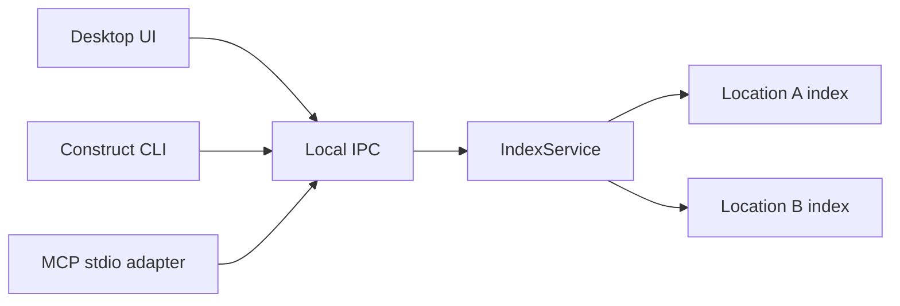

# RFC 05 — Local agent access

**Status:** Proposed

**Decision owner:** Product, native architecture, and security

## Question

How should coding agents use Construct's local retrieval without gaining a
second mutation path or requiring manual filesystem traversal?

## Product goal

An agent should be able to ask Construct:

- which registered locations are available;
- which documents are relevant to a query;
- what one saved document contains;
- which documents link to or from it;
- which bounded set of documents should be loaded as context.

The desktop UI, CLI, and MCP must use the same parser, index, ranking, and
context planner. Agent access is an adapter, not a separate retrieval product.

## Delivery decision

Do not wait for the entire graph and context roadmap before testing agent
value.

### Experimental pilot after lexical indexing

Expose:

- `list_locations`
- `search`
- `get`
- `related`
- `index_status`

The pilot validates whether agents open fewer files and consume less context.
Its packaging and schema may change.

### Supported surface after graph/context validation

Add:

- `build_context`
- bounded index refresh;
- documented installation and permissions;
- stable parity and concurrency tests.

No source-document mutation is part of either stage.

## Shared command model

Native requests and responses are transport-neutral. Thin adapters provide:

- Tauri commands for the desktop;
- human-readable or JSON CLI output;
- MCP tools over stdio.

Adapters do not implement independent ranking rules or read arbitrary paths.

All adapters call the shared `IndexService`. They never open a Location's
SurrealDB or SurrealKV directory directly.

## Service ownership and process model

RFC 02 introduces `IndexService` inside the Tauri native process as the sole
owner of all per-Location index connections. RFC 05 extracts or hosts the same
service in a local sidecar or daemon when independent agent access is delivered.

The resulting topology is:



This preserves one writer per database, one migration implementation, and one
ranking contract. A desktop, CLI, or MCP process must never fall back to opening
the embedded storage directly.

During RFC 02 the service stops with the desktop. RFC 05 owns background
lifecycle, IPC authentication, helper discovery, startup, shutdown, and recovery
when the desktop is closed.

## CLI shape

Illustrative commands:

```text
construct knowledge status
construct knowledge search
construct knowledge get
construct knowledge related
construct knowledge context
construct knowledge refresh
construct mcp serve
```

Human-readable output is the default for interactive CLI use. `--json` exposes
the shared typed response without internal SQL or database row IDs.

The user-facing executable may remain one `construct` command, but independent
access is backed by a dedicated local service process. Packaging may place the
service in a helper executable or in a multi-mode binary; this does not change
its exclusive ownership of the indexes.

## MCP transport

- stdio is the required default;
- no network listener opens automatically;
- the server initiates no outbound requests;
- stdout is protocol-only;
- diagnostics go to stderr without document contents;
- every request has result, content, graph-depth, and execution-time limits;
- access is limited to registered locations and may use a narrower allowlist.

## Proposed operations

Names are provisional.

| Operation | Purpose |
| --- | --- |
| `construct_list_locations` | List allowed locations, capabilities, and index state |
| `construct_search` | Search saved Markdown with visible filters and explanations |
| `construct_get` | Read one saved document by location and relative path |
| `construct_related` | Return bounded backlinks, outgoing links, and related documents |
| `construct_build_context` | Assemble a bounded provenance-rich context pack |
| `construct_index_status` | Report generation, freshness, findings, and capabilities |
| `construct_refresh_index` | Refresh only derived local state for allowed locations |

`refresh_index` mutates the disposable cache, not source knowledge.

## Identity and path behavior

Normal agent responses use:

- a stable Construct location ID;
- a human-readable location name;
- a normalized relative path.

Absolute paths remain private native data and are not included by default. A
local coding agent that needs to modify a file should already have the
repository in its workspace or receive an explicit user-controlled path
mapping outside retrieval.

The need for an optional trusted-client path-resolution operation must be
validated rather than assumed.

## Trust boundary

Construct itself remains local, but an MCP client may send retrieved content to
whatever model the user configured. Setup must explain:

- which locations the server can read;
- that returned content leaves Construct's control;
- how to use a narrower allowlist;
- how to stop the server and delete its derived cache;
- that no document-writing tool is exposed.

Starting the MCP server or granting a new location requires explicit user
configuration. Merely opening Construct does not expose a server.

## Excluded capabilities

The initial agent surface does not expose:

- create, edit, save, delete, move, or rename;
- arbitrary filesystem reads;
- absolute-path enumeration;
- arbitrary SQL;
- shell or Git commands;
- raw database access;
- unbounded directory listing;
- UI state unrelated to retrieval;
- automatic hosted embeddings or answer generation.

Git remains read-only in the desktop application and is not required by the
agent retrieval API.

## Concurrency

The desktop and agent process may coexist through the one local service.

- Readers see a complete committed index generation.
- Index writes are serialized by the per-Location `IndexService` worker.
- A crashed writer cannot activate a partial generation.
- Busy and unavailable states use bounded retries and actionable English
  errors.
- The MCP process can read while the desktop edits an unsaved buffer because
  the shared index represents saved files only.
- Once RFC 05 ships the sidecar lifecycle, it may refresh allowed indexes while
  the desktop is closed.

## Review workflow

`get` and `build_context` may return open reviews as a separate typed field.
Review payloads are never indistinguishable from source content.

An agent that addresses review comments still edits through its existing
filesystem authority, not through Construct MCP. It can remove resolved
`construct-review:v1` entries in the source file and Construct observes the
saved change normally.

## Pilot measurement

Use representative tasks across two or three real locations:

1. give the agent only filesystem access;
2. repeat with `search`, `get`, and `related`;
3. later repeat with `build_context`;
4. record files opened, tool calls, context tokens, time to useful evidence,
   and task correctness.

The agent interface earns supported-product status only if it materially
reduces traversal cost or improves answer quality.

## Acceptance criteria

- UI, CLI, and MCP return equivalent ranked results for the same saved corpus,
  request, and index generation.
- Source-document mutation is impossible through the initial agent surface.
- Requests are scoped to explicitly allowed registered locations.
- Normal structured responses omit absolute paths.
- Every operation has bounded output and execution time.
- The server performs no outbound network requests.
- Desktop and agent readers never observe a partial index generation.
- Setup clearly describes the external-client trust boundary.

## Open decisions

- Helper executable versus a multi-mode `construct` binary for hosting the
  dedicated service.
- Local IPC transport, authentication, and process discovery.
- Installation and discovery on macOS, Windows, and Linux.
- Default location allowlist and content limits.
- Whether trusted local clients ever receive resolved absolute paths.
- Stability promise for the Phase 1.5 pilot.

## Dependencies and handoff

The pilot depends on the [local Markdown index](02-local-markdown-index.md).
`build_context` additionally depends on
[graph and context retrieval](04-graph-context-retrieval.md). Review fields
follow [RFC 06](06-review-integration.md).
