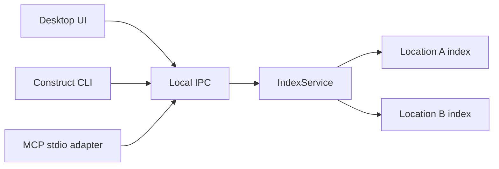

# RFC 05 — Local agent access

**Status:** First delivery implemented

**Decision owner:** Product, native architecture, and security

## Question

How should coding agents use Construct's local retrieval without gaining a
second mutation path or requiring manual filesystem traversal?

## Product goal

An agent should be able to ask Construct:

- which registered locations are available;
- which documents are relevant to a query;
- what one saved document contains;
- which documents link to or from it;
- which bounded set of documents should be loaded as context.

The desktop UI, CLI, and MCP must use the same parser, index, ranking, and
context planner. Agent access is an adapter, not a separate retrieval product.

## Delivery decision

Ship one local read-only MCP surface after lexical, direct-link, and context
retrieval. The public Construct executable is a multi-mode binary:

```text
Construct              desktop application
Construct service      exclusive local index owner
Construct mcp serve    stdio MCP adapter
```

The desktop and MCP adapter both use authenticated local IPC. The service can
outlive the desktop window, so agents can retrieve while the application is
closed. No source-document mutation or index rebuild tool is part of this
delivery.

## Shared command model

Native requests and responses are transport-neutral. Thin adapters provide:

- Tauri commands for the desktop;
- human-readable or JSON CLI output;
- MCP tools over stdio.

Adapters do not implement independent ranking rules or read arbitrary paths.

All adapters call the shared `IndexService`. They never open a Location's
SurrealDB or SurrealKV directory directly.

## Service ownership and process model

RFC 02 introduces `IndexService` inside the Tauri native process as the sole
owner of all per-Location index connections. RFC 05 extracts or hosts the same
service in a local sidecar or daemon when independent agent access is delivered.

The resulting topology is:



This preserves one writer per database, one migration implementation, and one
ranking contract. A desktop, CLI, or MCP process must never fall back to opening
the embedded storage directly.

During RFC 02 the service stops with the desktop. RFC 05 owns background
lifecycle, IPC authentication, helper discovery, startup, shutdown, and recovery
when the desktop is closed.

## CLI shape

The first user-facing agent command is `construct mcp serve`. Interactive
knowledge subcommands remain a later adapter over the same typed client.

## MCP transport

- stdio is the required default;
- no network listener opens automatically;
- the server initiates no outbound requests;
- stdout is protocol-only;
- diagnostics go to stderr without document contents;
- every request has result, content, graph-depth, and execution-time limits;
- access is limited to registered locations and may use a narrower allowlist.

## Proposed operations

Names are provisional.

| Operation | Purpose |
| --- | --- |
| `construct_list_locations` | List allowed locations, capabilities, and index state |
| `construct_get_location_overview` | Return hot memory, metadata counts, link health, and recent logs |
| `construct_get_location_activity` | Return bounded 1–15 day changed, served, and context activity |
| `construct_search_knowledge` | Search saved Markdown with visible filters and explanations |
| `construct_read_document` | Read one saved document by location and relative path |
| `construct_get_related_documents` | Return bounded backlinks and outgoing links |
| `construct_build_context_pack` | Assemble a bounded provenance-rich context pack |
| `construct_get_index_status` | Report generation, freshness, counts, storage, and errors |

Refresh and rebuild remain desktop actions in the first MCP contract.

Tool failures use MCP `isError` responses with both readable text and structured
content shaped as `{ error: { code, message } }`. Stable codes let agents
distinguish allowlist rejection, invalid arguments, missing documents, unknown
tools, and execution failures without parsing English copy.

## Hot memory

Each Location keeps a derived daily activity cache with a rolling 15-day
window. Counters remain separate:

- `changed_count`, `created_count`, and `removed_count` are updated only after a
  real saved-content reconciliation;
- `served_count` increments after a successful MCP document read;
- `context_count` increments for documents actually included in an MCP context
  pack;
- search candidates do not increment any counter;
- full index rebuilds do not fabricate source changes.

`construct_get_location_overview` reads every reserved OKF `log.md` available in
the active index, including nested scopes. OKF logs are useful but remain
optional and tolerant; a missing or unconventional log never blocks retrieval.

## Identity and path behavior

Normal agent responses use:

- a stable Construct location ID;
- a human-readable location name;
- a normalized relative path.

Absolute paths remain private native data and are not included by default. A
local coding agent that needs to modify a file should already have the
repository in its workspace or receive an explicit user-controlled path
mapping outside retrieval.

The need for an optional trusted-client path-resolution operation must be
validated rather than assumed.

## Trust boundary

Construct itself remains local, but an MCP client may send retrieved content to
whatever model the user configured. Setup must explain:

- which locations the server can read;
- that returned content leaves Construct's control;
- how to use a narrower allowlist;
- how to stop the server and delete its derived cache;
- that no document-writing tool is exposed.

Starting the MCP server or granting a new location requires explicit user
configuration. `--allow <location-id>` may be repeated; `--allow-all` is an
explicit broader choice. Starting without either fails. The desktop can copy a
ready-to-paste MCP configuration for the selected Location. Merely opening
Construct does not expose an MCP server.

## Excluded capabilities

The initial agent surface does not expose:

- create, edit, save, delete, move, or rename;
- arbitrary filesystem reads;
- absolute-path enumeration;
- arbitrary SQL;
- shell or Git commands;
- raw database access;
- unbounded directory listing;
- UI state unrelated to retrieval;
- automatic hosted embeddings or answer generation.

Git remains read-only in the desktop application and is not required by the
agent retrieval API.

## Concurrency

The desktop and agent process may coexist through the one local service.

- Readers see a complete committed index generation.
- Index writes are serialized by the per-Location `IndexService` worker.
- A crashed writer cannot activate a partial generation.
- Busy and unavailable states use bounded retries and actionable English
  errors.
- The MCP process can read while the desktop edits an unsaved buffer because
  the shared index represents saved files only.
- Once RFC 05 ships the sidecar lifecycle, it may refresh allowed indexes while
  the desktop is closed.

## Review workflow

Review comments remain excluded until RFC 07 defines their typed contract. They
are not mixed into source bodies, search, links, logs, or context packs.

## Pilot measurement

Use representative tasks across two or three real locations:

1. give the agent only filesystem access;
2. repeat with `search`, `get`, and `related`;
3. later repeat with `build_context`;
4. record files opened, tool calls, context tokens, time to useful evidence,
   and task correctness.

The agent interface earns supported-product status only if it materially
reduces traversal cost or improves answer quality.

## Acceptance criteria

- UI, CLI, and MCP return equivalent ranked results for the same saved corpus,
  request, and index generation.
- Source-document mutation is impossible through the initial agent surface.
- Requests are scoped to explicitly allowed registered locations.
- Normal structured responses omit absolute paths.
- Every operation has bounded output and execution time.
- The server performs no outbound network requests.
- Desktop and agent readers never observe a partial index generation.
- Setup clearly describes the external-client trust boundary.
- With the desktop closed, an allowed client can list, overview, search, read,
  inspect related documents, and build context through the service.
- Search does not heat activity; successful read and context operations do.
- Activity expires after 15 days and never contains absolute paths.

## Deferred decisions

- Windows named-pipe transport and Linux packaging.
- Interactive human-readable CLI knowledge commands.
- Stable public schema/versioning promise after the experimental pilot.
- Whether a future trusted local capability ever resolves absolute paths.
- Whether bounded index refresh belongs in a later agent contract.

## Dependencies and handoff

The pilot depends on the [local Markdown index](02-local-markdown-index.md).
`build_context` additionally depends on
[graph and context retrieval](04-graph-context-retrieval.md). Review fields
follow [RFC 07](07-review-integration.md).
