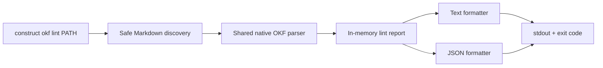

# RFC 06 — Stateless OKF linter

**Status:** CLI, desktop Health, and release pipeline implemented; first
clean-runner release and oracle comparison pending

**Decision owner:** Product, OKF compatibility, CLI, and release engineering

## Question

How should coding agents and CI validate an OKF bundle on demand without
registering it in Construct, starting the desktop application, or persisting
derived state?

## Product goal

An agent or maintainer should be able to run one command from a knowledge-base
repository and receive an actionable, deterministic report:

```text
construct okf lint .
```

The command should:

- validate the bundle with the same tolerant native parser used by Construct;
- print errors and warnings with relative paths and source positions;
- return an exit code suitable for CI;
- support machine-readable output;
- never modify the bundle;
- never create an index, cache, workspace entry, history record, or app state.

This turns OKF quality into a repository-level feedback loop:

```text
agent edits → linter reports → agent repairs → linter passes → CI protects
```

## Context

RFC 01 already provides a shared Rust parser with:

- tolerant OKF v0.1 and v0.2 consumption;
- open-ended typed YAML metadata;
- stable finding codes;
- error, warning, and info severities;
- relative document identities;
- optional source ranges;
- internal-link resolution and broken-link findings.

The desktop application currently uses that parser for bundle detection,
Explore, Graph, and document inspection. The persistent index stores aggregate
finding information for retrieval.

None of that persistence is necessary for linting. A linter is a bounded
process:

1. discover eligible Markdown below a supplied root;
2. inspect the saved files;
3. resolve bundle-local links;
4. print a report;
5. exit.

The result is derived in memory and discarded when the command ends.

The registered-Location experience now also presents the same native findings
inside Explore's **Health** view. This desktop adapter does not weaken the
stateless CLI boundary: it reads the saved-file bundle snapshot already used by
Explore and can explicitly refresh that snapshot without spawning the CLI,
opening SurrealDB, or changing project files.

Health adds human-oriented presentation:

- error, warning, info, and document counts;
- grouping by stable rule code;
- filtering by severity, path, rule, or message;
- navigation to the affected saved document in Source;
- a self-contained clipboard handoff for a coding agent;
- a `Repository policy` scope that applies `.constructignore`, plus
  `All Markdown` for an explicit strict inspection.

## Inspiration and boundary

The Obsidian community plugin
[OKF Enforcer](https://community.obsidian.md/plugins/okf-enforcer)
demonstrates useful validation patterns:

- errors are distinct from optional warnings;
- a vault-wide run lists each affected note;
- findings link a rule to a concrete file;
- large vaults are scanned in bounded work;
- validation and repair are separate commands.

Construct adopts the validation discipline, not the enforcement behavior.
OKF Enforcer's on-save hooks, default types, bulk auto-fix, index generation,
and automatic log entries are outside this RFC.

[`okflint`](https://github.com/mattdav/okflint) remains a useful independent
validator and CI oracle. The Construct linter exists because:

- Construct already has a v0.1/v0.2-compatible Rust interpretation;
- agents using Construct should see the same finding codes as the desktop;
- a native executable avoids a required Python runtime;
- the implementation can ship with the product and as a CI-friendly artifact.

The official OKF specification remains authoritative when implementations
disagree.

## Decision

Add a stateless `okf lint` subcommand to the Construct executable.

The linter operates directly on a supplied filesystem path. It does not require:

- a registered Location;
- the desktop application;
- the background index service;
- SurrealDB or SurrealKV;
- an MCP server;
- a workspace file;
- a network connection.

It is read-only. It must never offer an implicit fix mode.

## Command contract

### Basic usage

```text
construct okf lint [PATH]
```

`PATH` defaults to the current working directory.

Initial options:

```text
--format text|json
--fail-on error|warning|never
--exclude <GLOB>
--no-ignore-file
--max-findings <COUNT>
--no-color
--quiet
```

Proposed defaults:

- `--format text`;
- `--fail-on error`;
- standard Construct directory exclusions;
- `.constructignore` loaded from the supplied bundle root;
- color only when stdout is an interactive terminal;
- all findings printed up to a safe maximum;
- summary printed even when there are no findings.

The command accepts an ordinary directory. It does not require the root to have
been previously detected as an OKF Location. Explicit invocation is sufficient
intent to validate it as a bundle.

### Examples

Human or agent:

```text
construct okf lint .
construct okf lint ./knowledge
construct okf lint . --fail-on warning
```

Machine-readable:

```text
construct okf lint . --format json
```

CI:

```text
construct okf lint . --no-color --fail-on error
```

### Repository conformance policy

A bundle may commit `.constructignore` at its root. It contains one glob-like
path pattern per line:

```gitignore
# Agent infrastructure lives beside knowledge but is not an OKF concept.
AGENTS.md
CLAUDE.md
**/SKILL.md
```

The policy is intentionally narrower than an OKF validation profile. It does
not declare required metadata, a type vocabulary, or organization-specific
schema. It only identifies Markdown that does not participate in OKF
conformance.

Rules:

- blank lines and lines beginning with `#` are ignored;
- a basename-only pattern applies at any depth;
- `/` anchors a pattern to the bundle root;
- a trailing `/` applies to descendants of a directory;
- patterns are evaluated in order and `!` reintroduces a path;
- repeated `--exclude` patterns are evaluated after repository rules;
- `--no-ignore-file` bypasses `.constructignore` for a strict diagnostic run;
- invalid or oversized policy files fail with exit code `2`.

Crucially, a matched Markdown path is still discovered and remains a valid
internal-link target. Construct suppresses findings originating from that
document and removes it from OKF concept projections; it does not pretend the
file is absent. The general Markdown retrieval index remains independent.

## Output

### Text

Text output is concise, stable enough for people and agents, and optimized for
terminal logs:

```text
OKF lint: kb-supernova-company

ERROR OKF_TYPE_REQUIRED produtos/mentoria.md:1:1
  Concept documents must have a non-empty type.

WARNING OKF_LOG_DATE_HEADING_REQUIRED log.md:7:1
  log.md should contain date-grouped entries under ## YYYY-MM-DD headings.

WARNING OKF_LINK_BROKEN produtos/index.md:12:3
  The internal link './retired-product.md' does not resolve inside the bundle.

Summary: 18 documents · 1 error · 2 warnings · 0 info
Result: failed
```

Formatting rules:

- one finding starts with severity, stable code, relative path, and position;
- the English explanation follows on an indented line;
- absolute paths are never printed in normal output;
- findings use a deterministic order;
- the summary distinguishes no findings from an incomplete scan;
- color supplements text and is never the only severity signal;
- `--quiet` suppresses individual findings but retains the summary and exit
  behavior.

Default ordering:

1. errors;
2. warnings;
3. information;
4. relative path;
5. source position;
6. stable finding code.

### JSON

JSON is one versioned object written to stdout:

```json
{
  "schemaVersion": 1,
  "tool": {
    "name": "construct-okf-lint",
    "version": "0.1.0"
  },
  "bundle": {
    "name": "kb-supernova-company",
    "declaredOkfVersion": "0.2"
  },
  "summary": {
    "documents": 18,
    "errors": 1,
    "warnings": 2,
    "info": 0,
    "truncated": false
  },
  "findings": [
    {
      "code": "OKF_TYPE_REQUIRED",
      "severity": "error",
      "tier": "conformance",
      "relativePath": "produtos/mentoria.md",
      "range": {
        "start": { "line": 1, "column": 1 }
      },
      "message": "Concept documents must have a non-empty type."
    }
  ]
}
```

JSON mode writes protocol data only to stdout. Diagnostics about invocation,
permissions, or unexpected runtime failures go to stderr.

The schema is versioned before CI users depend on it. New optional fields may
be added compatibly; removals or semantic changes require a schema version
change.

### Agent usability

Stable text output is actionable in a coding-agent terminal, while JSON lets an
agent group, filter, or batch findings programmatically. The desktop Health
view additionally serializes its currently visible scope into a self-contained
clipboard handoff. That handoff is a presentation convenience over the same
findings, not another output schema or validator.

Agents should be able to run:

```text
construct okf lint . --format json
```

repair a bounded set of files, and rerun the same command until the desired
failure threshold passes.

## Exit codes

Exit codes are part of the public contract:

| Code | Meaning |
| ---: | --- |
| `0` | The scan completed and no finding met the configured failure threshold |
| `1` | The scan completed and at least one finding met the failure threshold |
| `2` | Invocation, configuration, permission, or unexpected runtime failure |

Examples:

- with the default `--fail-on error`, warnings print but do not fail CI;
- `--fail-on warning` fails on warnings or errors;
- `--fail-on never` always returns `0` after a successful scan and is useful for
  advisory CI;
- parser findings belong to the report and return `1` according to the selected
  threshold, not `2`;
- an unreadable root or invalid CLI argument returns `2`.

Signal termination follows platform conventions and is not remapped.

## Rule tiers

Every finding belongs to a visible tier.

### Conformance

Base OKF requirements, including:

- parseable YAML frontmatter on concept documents;
- a non-empty scalar `type`;
- valid reserved-document boundaries;
- required reserved-document structure;
- bundle-relative paths that cannot escape the root.

Conformance errors determine the default CI result.

### Compatibility

Version-aware observations, including:

- unsupported future `okf_version`;
- invalid shapes for normalized v0.1 or v0.2 fields;
- invalid official lifecycle, provenance, generation, verification, or
  freshness metadata;
- values Construct can preserve but cannot normalize confidently.

Compatibility findings do not reject unknown metadata keys or free-form
semantic `type` values.

### Hygiene

Optional quality and navigation observations, including:

- missing recommended title or description;
- unconventional log headings;
- weak progressive-disclosure indexes;
- unresolved internal links;
- explicit stale state.

Broken links are permitted by OKF. They may be warnings, but never become base
conformance errors merely because they are unresolved.

### Profiles

Organization-specific schemas may later add profile findings for:

- recommended or required custom fields;
- chosen lifecycle values;
- directory expectations;
- relationship shapes;
- naming conventions.

Profiles must be explicit and versioned. Their rules remain distinguishable
from base OKF conformance.

The `knowledge` repository is a useful high-quality comparison corpus, but it
must not silently become Construct's universal schema. A future profile may
codify selected conventions intentionally.

## Discovery and filesystem behavior

The linter reuses Construct's safe Markdown discovery rules where appropriate:

- recurse below the supplied root;
- include eligible Markdown extensions defined by the parser contract;
- skip symlinks;
- normalize relative paths without escaping the root;
- exclude generated and dependency directories such as `.git`,
  `node_modules`, `target`, vendor caches, and platform build output;
- load `.constructignore` from the explicit lint root;
- allow repeated explicit `--exclude` patterns that compose with it;
- retain policy-matched Markdown paths for internal-link resolution;
- continue after an unreadable individual file when safe and report it;
- bound document size, frontmatter size, YAML nesting, link count, and total
  findings.

The linter does not read Construct's registered Locations or application
exclusion state. The same command in the same repository and tool version
should produce the same ordered report.

## Statelessness

A lint run may allocate memory and ordinary process-temporary resources while it
executes. It must not persist derived product state.

Specifically, the command does not create or update:

- per-Location SurrealDB indexes;
- SurrealKV directories;
- workspace state;
- registered Locations;
- watcher state;
- history entries;
- activity counters;
- MCP allowlists;
- user configuration;
- repository files.

The command may read `.constructignore` and an explicit future repository
profile, but it never creates or updates either.

Temporary operating-system files should be avoided. If a future implementation
needs them for bounded external sorting, they must be removed on normal and
abnormal completion and contain no more data than necessary.

## Architecture

The command should reuse the pure native OKF inspection boundary rather than
invoke the desktop or duplicate parsing.



The core API should be independent of CLI formatting:

```text
lint_bundle(root, options) -> LintReport
```

`LintReport` contains no absolute paths in its serializable public view. Native
errors may retain the root internally for local diagnostics on stderr.

The linter must not call `IndexService`. This keeps CI startup small and proves
that OKF compatibility does not depend on the retrieval database.

## CI distribution

For local agents, the command can be exposed by the Construct executable that
already ships inside the macOS application bundle.

For CI and knowledge repositories, each tagged GitHub Release contains
standalone `construct` CLI archives for macOS ARM, macOS Intel, and Windows x64.
The tag-driven release workflow builds the app and CLI from the same commit,
publishes platform-specific archives to a draft release, and assembles a
`SHA256SUMS` manifest.

CI examples must pin an explicit released version and verify its checksum. They
must not download a mutable “latest” artifact. Package-manager installation is
deferred until signed releases and release automation are proven.

A dedicated GitHub Action is convenience packaging over the CLI, not a second
validator.

## Repair workflow

The linter reports; it does not repair.

Expected coding-agent loop:

1. run the linter;
2. inspect one bounded class of findings;
3. read repository instructions and affected documents;
4. edit through normal workspace tools;
5. preserve unknown fields and valid content;
6. avoid inventing `type`, links, or metadata;
7. rerun the linter;
8. report changed files and remaining uncertainty.

Repository instructions can tell agents which threshold CI uses and whether
hygiene warnings are expected to be clean.

Any future auto-fix mode requires a separate mutation RFC. It must not be
introduced as an undocumented flag.

## Privacy and security

- Processing is local.
- The command performs no network requests.
- Source documents remain authoritative and unchanged.
- Normal output uses relative paths.
- YAML, Markdown, Mermaid, HTML, profile content, and code blocks are parsed as
  data and never executed.
- External links are not fetched.
- Symlink traversal is disabled.
- stdout and stderr never include document bodies by default.
- JSON output is suitable for external tools but remains under the caller's
  control once emitted.

## Reliability and performance

The first implementation performs a full stateless scan on every invocation.
This is the correct baseline for CI correctness and avoids cache invalidation.

Targets should be measured on synthetic and real bundles:

- useful progress or first output without waiting for every file when text mode
  can stream deterministically;
- bounded memory on 10,000 Markdown documents;
- deterministic JSON after a complete scan;
- no UI-thread concern because the command is a standalone process;
- interruption never changes repository or Construct state.

Parallel parsing is allowed only if it preserves deterministic output and
bounded resource use.

If full-scan latency later becomes a demonstrated CI problem, an explicit
caller-owned cache may be proposed separately. No cache is part of this RFC.

## Non-goals

- Persisting findings or health history.
- Exposing findings through MCP.
- Registering a Location.
- Starting or querying the local index service.
- Using SurrealDB or SurrealKV.
- Watching files after the command exits.
- Automatically editing or normalizing a bundle.
- Adding on-save enforcement or autosave.
- Selecting a default `type`.
- Generating `index.md` or appending `log.md`.
- Treating `knowledge` as an implicit schema.
- Requiring Obsidian, Python, or a hosted validator.
- Replacing independent conformance testing against `okflint`.

## Acceptance criteria

- `construct okf lint [PATH]` can validate an unregistered repository with the
  desktop application closed.
- A successful run leaves no repository, workspace, index, history, activity,
  or configuration changes.
- Text output includes stable code, severity, relative path, optional range,
  message, summary, and result.
- JSON output is a single versioned object and writes no non-protocol data to
  stdout.
- Exit codes distinguish pass, lint failure, and runtime or invocation failure.
- The default threshold fails on conformance errors but not optional warnings.
- Unknown frontmatter keys and free-form `type` values do not fail base OKF
  validation.
- Broken links remain non-fatal unless an explicit future profile says
  otherwise.
- Findings are deterministically ordered.
- Standard traversal exclusions prevent scanning generated dependency trees.
- `.constructignore` and explicit `--exclude` rules suppress conformance checks
  while retaining matched Markdown as link-resolvable paths.
- `--no-ignore-file` exposes a strict run that bypasses repository policy.
- The linter and desktop inspector use the same parser and stable finding codes.
- A 10,000-document stateless scan stays within the accepted time and memory
  budgets.
- The first delivery has no source mutation path.

## Evaluation

Evaluate against:

- the synthetic v0.1/v0.2 compatibility corpus;
- `knowledge` as a high-quality real bundle;
- at least two older partially conforming knowledge repositories;
- a synthetic 10,000-document bundle;
- independent `okflint` output where contracts overlap;
- a clean CI runner with no Construct application data.

Measure:

- correct error, warning, and info classification;
- false positives and false negatives;
- text and JSON determinism;
- cold full-scan time;
- peak memory;
- agent time from first report to a passing rerun;
- accidental or unnecessary file changes;
- CI installation time and artifact size.

## Open decisions

- The first release reports the shared parser's existing hygiene findings for
  reserved-document conventions and internal links. Additional recommended
  metadata rules require an explicit follow-up.
- `--max-findings` limits output only. The scan, summary counts, and exit
  decision always use the complete finding set.
- The default output limit is 1,000 findings; callers may configure up to
  100,000.
- Schema-bearing profiles remain deferred. `.constructignore` is only a
  non-concept path policy and must not grow into a hidden taxonomy.
- Whether SARIF is valuable after stable JSON exists.
- Whether a dedicated installer Action is valuable after pinned release assets
  have been exercised in real knowledge repositories.
- The final performance budget and release gate for 1,000 and 10,000 documents.

## Implementation slices

### Slice 1 — Pure lint report

- **Implemented:** safe directory discovery without registered-Location state;
- **Implemented:** RFC 01 parser reuse for complete in-memory bundle inspection;
- **Implemented:** tiered, deterministically ordered `LintReport`;
- **Implemented:** text and JSON formatter tests;
- **Implemented:** threshold and exit-decision tests.

### Slice 2 — CLI and local agent trial

- **Implemented:** `construct okf lint`, including text/JSON, thresholds,
  exclusions, output limits, color control, and quiet output;
- **Implemented:** repository-owned `.constructignore`, ordered negation,
  composition with CLI exclusions, strict bypass, and link-resolvable ignored
  paths;
- **Implemented:** source-build invocation and bundled-executable smoke path;
- **Implemented:** initial field validation against `knowledge` and two older
  repositories;
- **Implemented:** Explore Health view with summaries, scopes, filters, source
  navigation, explicit refresh, and agent clipboard handoff;
- **Pending workflow trial:** have coding agents repair bounded finding batches;
- **Implemented:** local workflow documentation.

### Slice 3 — CI distribution

- **Implemented:** tag-driven macOS ARM, macOS Intel, and Windows x64 build
  matrix;
- **Implemented:** draft GitHub Release with DMG/NSIS app bundles, standalone
  CLI archives, and `SHA256SUMS`;
- **Implemented:** release-tag consistency check across every version source;
- **Implemented:** maintainer release and artifact-verification documentation;
- **Pending:** run the first tagged candidate on clean hosted runners;
- **Pending:** document a minimal pinned download/checksum CI example;
- **Pending:** compare behavior with the independent oracle corpus.

Profiles, SARIF, package-manager distribution, and any fix mode remain separate
decisions.

## Dependencies and handoff

This RFC depends only on:

- [RFC 01](01-okf-compatibility.md) for the shared tolerant parser, finding
  codes, and conformance corpus;
- the existing safe Markdown discovery boundary.

It deliberately does not depend on the persistent index, Search, Graph, MCP, or
registered Locations.

Its implementation should precede
[RFC 07](07-review-integration.md). A stateless linter gives knowledge
repositories and coding agents a quality gate without coupling Review work to
retrieval persistence.
