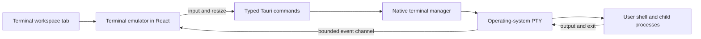

# RFC — Terminal integration

**Status:** Accepted for the external launcher. Embedded terminal remains
Proposed.

**Date:** 2026-07-29

**Scope:** The external launcher is authorized for implementation. The
PTY-backed embedded terminal still requires a separate acceptance decision.

## Question

How should Construct help users move from reading or editing knowledge to
working with a coding agent in a terminal?

Two approaches are viable:

1. launch the user's preferred terminal application at the relevant Location
   or document directory;
2. host a real terminal session as a first-class tab inside Construct.

The first approach solves the immediate navigation friction at low cost. The
second can turn Construct into a more complete agent workspace, but introduces
a process-hosting subsystem and a substantially larger security and
cross-platform surface.

## Proposed decision

Adopt a progressive, hybrid path:

1. **Phase 1 — External terminal launcher.** Add explicit actions that open a
   supported terminal application at a validated directory.
2. **Phase 2 — Observe usage.** Learn whether users only need fast handoff or
   repeatedly need terminal and document state in the same Construct layout.
3. **Phase 3 — Embedded terminal, if justified.** Add a real PTY-backed
   terminal as a first-class workspace tab without changing the Phase 1
   commands or Location model.

The external launcher is the recommended first delivery. An embedded terminal
is not rejected; it is gated by evidence that in-app session continuity creates
enough value to justify its complexity.

## Why this belongs in Construct

Construct already acts as a bridge between Markdown knowledge and coding
agents. A common workflow is:

1. inspect a Location;
2. read, search, or review a document;
3. decide that an agent should investigate or change something;
4. open a terminal;
5. navigate back to the repository;
6. start Codex, Claude Code, or another tool.

Construct knows the correct repository and document paths. Removing the manual
navigation step is useful even if the terminal remains a separate application.

An embedded terminal becomes strategically interesting only when the desired
workflow is stronger:

- keep a terminal beside a document in a split;
- preserve one visible agent session per task or Location;
- move between search, review, source, and terminal without changing apps;
- make the terminal part of the workspace layout.

Those are product capabilities, not merely a faster way to run `cd`.

## Alternatives

| Concern | External application | Embedded terminal |
| --- | --- | --- |
| User experience | Opens Terminal, iTerm, Ghostty, WezTerm, or another supported app | Appears as a tab or split inside Construct |
| Initial effort | Low | Medium to high |
| Existing configuration | Reuses the user's shell, theme, fonts, plugins, history, and shortcuts | Construct must expose or choose terminal settings |
| Interactive programs | Delegated to a mature terminal | Construct must correctly support PTYs, ANSI, resizing, signals, and full-screen TUIs |
| Process lifecycle | Owned by the terminal application | Owned by Construct |
| Security boundary | Construct launches a predefined app at a path | Construct hosts a shell with the user's full operating-system authority |
| Workspace integration | Handoff only | Native tabs, splits, and session identity |
| macOS delivery | Small native adapter | Frontend emulator plus native PTY manager |
| Windows delivery | Adapter for Windows Terminal or configured application | ConPTY integration and Windows-specific lifecycle testing |
| Failure impact | Terminal launch fails independently | A terminal failure can affect Construct responsiveness or shutdown |
| Product differentiation | Useful convenience | Makes Construct a more complete agent workspace |

## Phase 1 — External terminal launcher

### User experience

Construct should offer two commands:

- **Open terminal at Location** — starts in the root of the active Location.
- **Open terminal here** — starts in the directory containing the active
  document.

The commands may be exposed from:

- the Location context menu;
- the document context menu or toolbar overflow;
- the command palette;
- a keyboard shortcut assigned through the existing shortcut model.

The action must be explicit. Opening a file, Location, review, or search result
must never launch a terminal automatically.

### Terminal preference

The first delivery should offer a **Choose terminal application…** action from
the Location and document context menus. A future general Settings surface may
present the same preference without changing its persisted contract.

On macOS, the first supported set should be small and explicit:

- Apple Terminal;
- iTerm2;
- Ghostty;
- WezTerm.

Construct should detect installed supported applications and present readable
names. A missing configured application produces an English error and offers
the settings action.

The first release should not accept an arbitrary shell command template.
Command templates create avoidable quoting, injection, portability, and support
problems. Additional terminals should be added through small reviewed adapters.

### Native contract

The frontend sends identity, not an unrestricted command:

```ts
type OpenTerminalRequest = {
  locationId: string;
  relativeDirectory?: string;
  terminalApp?: TerminalApplication;
};
```

The native layer:

1. resolves `locationId` from registered workspace state;
2. resolves and canonicalizes the requested directory;
3. verifies that it exists and is a directory;
4. verifies that it remains inside the registered Location;
5. selects the configured terminal adapter;
6. launches the application with the directory as structured input;
7. returns a typed result or an English error.

The frontend must not pass an absolute path or executable chosen by rendered
Markdown.

An illustrative response:

```ts
type OpenTerminalResult = {
  application: string;
  locationId: string;
  relativeDirectory: string;
};
```

### Adapter boundary

Each adapter is responsible only for translating a validated directory into the
supported application's launch mechanism.

```text
OpenTerminalRequest
        ↓
Location and path validation
        ↓
Terminal adapter selection
        ↓
Apple Terminal / iTerm2 / Ghostty / WezTerm / Windows Terminal
```

Adapters must not:

- execute content copied from a document;
- interpret a path as shell source;
- run agent commands automatically;
- expose a generic arbitrary-command API;
- write to repository files;
- become reachable through MCP.

### macOS behavior

Phase 1 targets macOS as the primary desktop environment and carries the same
typed contract to the Windows preview through Windows Terminal.

The implementation should prefer application launch APIs or argument arrays
over constructing a shell command string. Terminal-specific automation should
be isolated behind the adapter and used only when the application cannot
otherwise open a directory correctly.

Launching the terminal gives that application its normal user authority.
Construct does not monitor subsequent commands, terminal history, output, or
process state.

### Windows behavior

The same product command supports Windows through Windows Terminal when
installed.

The Windows adapter must:

- pass the starting directory without shell-string interpolation;
- support paths containing spaces and non-ASCII characters;
- report clearly when no supported application is available;
- avoid requiring a Rust toolchain or development environment on the user's
  machine.

## Phase 2 — Evidence before embedding

The launcher should be evaluated using product evidence rather than only
technical preference.

Useful signals include:

- how often terminal actions are used;
- whether users open terminals mostly from Locations or individual documents;
- whether users immediately return to Construct;
- direct requests for terminal tabs, splits, or session restoration;
- friction caused by window switching;
- whether agent sessions are routinely associated with one document or review.

Construct must not collect path names, commands, terminal contents, repository
contents, or agent output as analytics.

If the product has no telemetry, interviews, issues, and observed workflows are
sufficient. The decision does not require surveillance.

### Gate for an embedded terminal

Proceed when at least one of these needs is repeatedly demonstrated:

- terminal and document must remain visible side by side;
- users manage multiple agent sessions and lose their association with
  Locations or tasks;
- external window switching is a material interruption in the core workflow;
- a first-class terminal tab enables a workflow that an external launcher
  cannot reasonably provide.

“It would be convenient” alone is not a sufficient gate for taking ownership of
shell process hosting.

## Phase 3 — Embedded terminal

### Product model

An embedded terminal should be a new workspace tab kind, not another document
mode.

The current model treats every pane tab as a Markdown document and gives it
Preview, Edit, Review, Source, and Diff modes. A terminal has different
identity, lifecycle, and controls.

The direction should be a discriminated union:

```ts
type WorkspaceTab = DocumentTab | TerminalTab;

type DocumentTab = {
  kind: "document";
  // Existing document state.
};

type TerminalTab = {
  kind: "terminal";
  id: string;
  title: string;
  locationId: string;
  relativeDirectory: string;
  sessionId: string;
  status: "starting" | "running" | "exited" | "failed";
};
```

Both tab kinds can use the existing pane, split, activation, move, and close
interactions. Only document tabs participate in save, Review, Source, Diff, and
file-conflict behavior.

### Architecture



The frontend needs a terminal emulator such as xterm.js. A text area or stream
of process output is insufficient because interactive shells require:

- cursor control;
- ANSI escape sequences;
- resize negotiation;
- Ctrl+C and other control input;
- alternate screen buffers;
- Unicode handling;
- full-screen terminal applications.

The native layer needs a real PTY abstraction. Ordinary redirected stdin and
stdout do not reproduce terminal semantics. A Rust library such as
`portable-pty` is a candidate, subject to a dependency and platform review.

### Native session manager

The native core should own a `TerminalManager` whose sessions are referenced by
opaque IDs.

Each session tracks:

- session ID;
- Location identity;
- initial canonical directory;
- child and PTY handles;
- input writer;
- output reader;
- current rows and columns;
- state and exit information.

The minimum commands are:

- create a terminal session;
- write input;
- resize the PTY;
- close the session.

Output and lifecycle messages should use a bounded per-session channel. PTY
reads are commonly blocking and must run away from the UI thread. Output should
be batched to avoid flooding the webview during high-volume commands.

### Session behavior

- The shell starts only after an explicit user action.
- The default directory is the active Location root.
- **Open terminal here** may use the active document's containing directory.
- Moving a tab between panes does not restart its session.
- Inactive terminal tabs may continue running.
- Closing a running terminal asks for confirmation and terminates its session
  and child processes.
- Closing Construct terminates every session it created.
- A crash must not intentionally leave detached child processes behind.
- Terminal sessions are not restored after application restart in the first
  embedded release.
- Terminal scrollback, commands, and output are not written to workspace state.

The initial working directory is a convenience and provenance marker, not a
sandbox. After startup, the user can navigate anywhere their operating-system
account permits.

### Shell selection

On macOS, Construct should start the user's configured login shell when it is
valid and fall back to the platform default. User shell startup files may run,
as they do in a normal terminal.

Windows shell selection requires a separate implementation decision before the
embedded Windows phase. Likely candidates are PowerShell 7, Windows PowerShell,
and Command Prompt, with a user preference and deterministic fallback order.

Construct should not silently inject an agent command into a newly created
shell. A future explicit action such as **Start Codex in terminal** requires a
separate product and security decision.

## Security and privacy

### External launcher boundary

Construct chooses a supported terminal adapter and a validated starting
directory. After launch:

- the terminal application owns the process;
- Construct cannot see its commands or output;
- the terminal has the user's normal machine access;
- no additional content is passed from the current document.

### Embedded terminal boundary

An embedded shell is not confined to a Location. It can read and modify files,
use credentials, access the network, and run any program allowed to the user.
The interface must describe this honestly.

The embedded terminal must never be callable through:

- Construct MCP tools;
- Markdown links or rendered HTML;
- Review comments;
- knowledge-search results;
- agent-generated context packs;
- automatic workspace restoration.

Terminal output must not be:

- indexed as knowledge;
- added to history;
- stored in logs or telemetry;
- used to create graph edges;
- inserted into a document without an explicit user copy or paste.

Potentially sensitive terminal features such as operating-system clipboard
control through escape sequences should be disabled initially unless they
receive a dedicated security review.

## Relationship to existing product rules

Terminal integration does not change these invariants:

- Markdown files remain authoritative.
- Documents still use explicit save.
- Git integration remains read-only.
- MCP remains read-only and cannot execute shell commands.
- OKF Locations remain user-registered filesystem boundaries for Construct's
  file operations.

Commands executed by the user in their terminal may of course modify Git and
files. Those actions belong to the terminal process, not Construct's Git
integration.

## Failure behavior

| Failure | Required behavior |
| --- | --- |
| No active Location | Disable the action or explain how to select a Location |
| Document no longer exists | Offer the Location root when it is still available |
| Directory escapes the Location | Reject the request before launching |
| Configured terminal is missing | Show an English error and open terminal settings |
| Terminal adapter fails | Preserve Construct state and report the selected application |
| Embedded shell cannot start | Keep the tab in a failed state with retry and close actions |
| Embedded output consumer falls behind | Apply bounded buffering and visible truncation rather than freezing the app |
| Construct exits | Close all embedded sessions; external applications remain independent |

## Accessibility

The launcher commands must be keyboard accessible and expose the target
Location or directory in their accessible labels.

An embedded terminal must:

- provide a visible focus state;
- not trap navigation without a documented escape shortcut;
- preserve standard terminal keyboard input while focused;
- announce exited and failed states outside the character grid;
- provide sufficient contrast through Construct's theme;
- document any limitations of screen-reader interaction.

## Performance expectations

### External launcher

- The native call should return promptly after handing off to the application.
- No scanning, indexing, or document read is required.
- A launch failure must not block the main UI.

### Embedded terminal

Provisional targets:

- visible terminal startup within 500 ms, excluding slow user shell startup
  scripts;
- local input feedback under 50 ms at p95;
- no long task on the webview main thread during sustained output;
- a bounded default scrollback, initially 10,000 lines;
- reliable resize after pane and window changes;
- no orphaned child process in lifecycle tests.

## Testing strategy

### External launcher

- unit tests for path resolution and adapter selection;
- Location-root and document-directory integration tests;
- paths with spaces, accents, and Unicode;
- missing application and invalid-directory behavior;
- symlink and `..` escape attempts;
- manual launch tests for each supported application;
- packaged-app tests, because Finder-launched environments differ from
  development shells.

### Embedded terminal

- reducer and component tests for mixed document and terminal tabs;
- native lifecycle tests for create, input, resize, exit, and close;
- interactive smoke tests using shell prompts and full-screen programs;
- Ctrl+C and signal handling;
- UTF-8, ANSI colors, alternate screen, and rapid output;
- closing a terminal with a running child;
- closing Construct with multiple sessions;
- macOS Apple Silicon and Intel packaging tests;
- Windows ConPTY tests before declaring embedded Windows support.

## Rollout

### Stage 1 — Launcher spike

- validate the supported macOS terminal launch mechanisms;
- confirm packaged-app behavior;
- validate directory paths containing spaces and Unicode.

### Stage 2 — External launcher product slice

- add typed native request and adapters;
- add terminal preference;
- add Location and document actions;
- add errors, tests, and user-guide documentation;
- ship macOS support.

### Stage 3 — Windows launcher

- add Windows Terminal and fallback behavior;
- validate in the distributed Windows package;
- update installation and user documentation.

### Stage 4 — Embedded-terminal decision

- review usage and qualitative evidence;
- document whether the gate has been met;
- if accepted, update the product specification and architecture before
  implementation.

### Stage 5 — Embedded terminal

- introduce `WorkspaceTab`;
- build a macOS PTY-backed vertical slice;
- harden lifecycle, buffering, accessibility, and security;
- add Windows ConPTY support before describing the feature as cross-platform.

## Acceptance criteria for the external launcher

- **TERM-001:** A user can open a supported terminal at the active Location
  root through an explicit action.
- **TERM-002:** A user can open a supported terminal at the active document's
  containing directory.
- **TERM-003:** The native layer derives and validates the absolute directory
  from Location identity and a relative path.
- **TERM-004:** A missing or unsupported terminal produces an actionable
  English error.
- **TERM-005:** Paths with spaces, accents, and Unicode open correctly.
- **TERM-006:** No document content or command is sent to the terminal.
- **TERM-007:** The launcher is unavailable through MCP and rendered content.
- **TERM-008:** Launching a terminal does not modify the workspace, document,
  index, or Git state.
- **TERM-009:** The preference lists only installed supported applications or a
  clearly identified platform fallback.
- **TERM-010:** Packaged-app behavior is tested on every platform declared
  supported.

## Additional acceptance criteria for a future embedded terminal

- **TERM-EMBED-001:** Terminal is a first-class workspace tab, not a document
  mode.
- **TERM-EMBED-002:** A real PTY supports interactive shells, resize, control
  input, Unicode, and full-screen terminal applications.
- **TERM-EMBED-003:** Closing a terminal terminates the session and its child
  processes.
- **TERM-EMBED-004:** Closing Construct leaves no intentionally detached
  terminal sessions.
- **TERM-EMBED-005:** Terminal commands, output, and scrollback are not persisted
  or indexed.
- **TERM-EMBED-006:** No agent, MCP client, document, or automatic workflow can
  create a session or write terminal input.
- **TERM-EMBED-007:** Sustained output cannot freeze the Construct UI or grow
  memory without a bound.
- **TERM-EMBED-008:** Existing explicit-save, conflict, Review, and document-tab
  behavior remains unchanged.

## Decisions recorded by this RFC

1. External launch and embedded terminal are complementary, not mutually
   exclusive.
2. The external launcher is the recommended first delivery.
3. Launch requests use Location identity and relative directories, not arbitrary
   executable strings.
4. Terminal commands are always initiated explicitly by the user.
5. Terminal integration is not exposed to MCP or agents.
6. An embedded terminal requires a real PTY and a first-class tab type.
7. Embedded sessions and output are ephemeral by default.
8. The first supported applications are Apple Terminal, iTerm2, Ghostty,
   WezTerm, and Windows Terminal on their respective platforms.
9. The first action asks for an explicit choice when multiple supported
   terminals are installed and automatically uses the only available adapter
   otherwise.
10. Location-root handoff appears in the Locations header and Location context
    menu. Document-directory handoff appears in the toolbar plus file and tab
    context menus.
11. No keyboard shortcut or command-palette entry is assigned in the first
    delivery.

## Remaining open decisions

- Which keyboard shortcut, if any, avoids conflicts with terminal applications
  and current Construct shortcuts?
- What qualitative or quantitative threshold is sufficient to authorize the
  embedded-terminal phase?
- If embedding is accepted, should a terminal tab title follow shell title
  escape sequences or remain controlled by Construct?
- Can the native PTY layer reliably distinguish an idle prompt from a foreground
  process for close confirmation on every supported platform?

## Documentation

The external-launcher delivery updates:

- add the commands and security boundary to
  [product-spec.md](../product-spec.md);
- document the native adapter boundary in
  [architecture.md](../architecture.md);
- add terminal selection and usage to [user-guide.md](../user-guide.md).

Before implementing an embedded terminal:

- update the workspace tab model and process-hosting boundary in the product
  specification and architecture;
- document PTY lifecycle and shutdown behavior;
- document that a Location is an initial directory, not a terminal sandbox;
- add the new dependencies and platform support matrix to the development
  guide.

The embedded-terminal proposal remains non-current until its documentation and
implementation decision are separately accepted.

## References

- [xterm.js](https://xtermjs.org/)
- [xterm.js terminal API](https://xtermjs.org/docs/api/terminal/classes/terminal/)
- [xterm.js addons](https://xtermjs.org/docs/guides/using-addons/)
- [portable-pty and the WezTerm project](https://github.com/wezterm/wezterm)
- [Tauri command invocation](https://v2.tauri.app/develop/calling-rust/)
